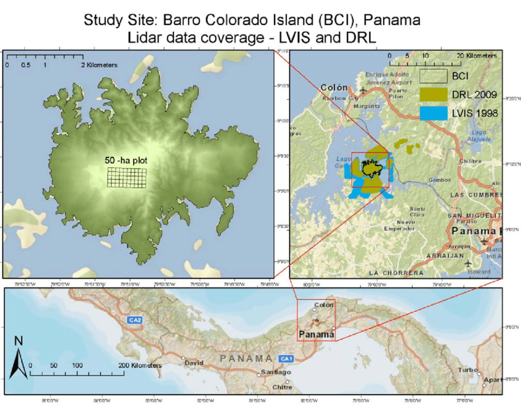

```{r setup, include=FALSE}
BioDataScience2::learnr_setup()
SciViews::R()
library(BioDataScience)
library(ade4)

# Preparation dataset ------
bci <- read("BCI", package = "vegan")

# sciviews functions ---------------

SciViews::R()
library(broom)

# function mds for several multidimensionnal scaling functions ------
mds <- function(dist, k = 2, type = c("metric", "nonmetric", "cmdscale",
                                      "wcmdscale", "sammon", "isoMDS", "monoMDS", "metaMDS"), p = 2, ...) {
  type <- match.arg(type)
  res <- switch(type,
                metric = ,
                wcmdscale = structure(vegan::wcmdscale(d = dist, k = k, eig = TRUE, ...),
                                      class = c("wcmdscale", "mds", "list")),
                cmdscale = structure(stats::cmdscale(d = dist, k = k, eig = TRUE, ...),
                                     class = c("cmdscale", "mds", "list")),
                nonmetric = ,
                metaMDS = structure(vegan::metaMDS(comm = dist, k = k, ...),
                                    class = c("metaMDS", "monoMDS", "mds", "list")),
                isoMDS = structure(MASS::isoMDS(d = dist, k = k, ...),
                                   class = c("isoMDS", "mds", "list")),
                monoMDS = structure(vegan::monoMDS(dist = dist, k = k, ...),
                                    class = c("monoMDS", "mds", "list")),
                sammon = structure(MASS::sammon(d = dist, k = k, ...),
                                   class = c("sammon", "mds", "list")),
                stop("Unknown 'mds' type ", type)
  )
  # For non-metric MDS, we add also data required for the Shepard plot
  if (type %in% c("nonmetric", "sammon", "isoMDS", "monoMDS", "metaMDS"))
    res$Shepard <- MASS::Shepard(d = dist, x = res$points, p = p)
  res
}
class(mds) <- c("function", "subsettable_type")

# plot.mds : MDS2 ~ MDS1 --------------------------------
plot.mds <- function(x, y, ...) {
  points <- tibble::as_tibble(x$points, .name_repair = "minimal")
  colnames(points) <- paste0("mds", 1:ncol(points))
  
  plot(data = points, mds2 ~ mds1,...)
}

autoplot.mds <- function(object,  labels, ...) {
  points <- tibble::as_tibble(object$points, .name_repair = "minimal")
  colnames(points) <- paste0("mds", 1:ncol(points))
  
  if (!missing(labels)) {
    if (length(labels) != nrow(points))
      stop("You must provide a character vector of length ", nrow(points),
           " for 'labels'")
    points$.labels <- labels
    chart::chart(points, mds2 ~ mds1 %label=% .labels, ...) +
      geom_point() +
      ggrepel::geom_text_repel() +
      coord_fixed(ratio = 1)
  } else {# Plot without labels
    chart::chart(points, mds2 ~ mds1, ...) +
      geom_point() +
      coord_fixed(ratio = 1)
  }
}

shepard <- function(dist, mds, p = 2)
  structure(MASS::Shepard(d = dist, x = mds$points, p = p),
            class = c("shepard", "list"))

plot.shepard <- function(x, y, l.col = "red", l.lwd = 1,
                         xlab = "Observed Dissimilarity", ylab = "Ordination Distance", ...) {
  she <- tibble::as_tibble(x, .name_repair = "minimal")
  
  plot(data = she, y ~ x, xlab = xlab, ylab = ylab, ...)
  lines(data = she, yf ~ x, type = "S", col = l.col, lwd = l.lwd)
}

autoplot.shepard <- function(object,  alpha = 0.5, l.col = "red", l.lwd = 1,
                             xlab = "Observed Dissimilarity", ylab = "Ordination Distance", ...) {
  she <- tibble::as_tibble(object)
  
  chart(data = she, y ~ x) +
    geom_point(alpha = alpha) +
    geom_step(chart::f_aes(yf ~ x), direction = "vh", col = l.col, lwd = l.lwd) +
    labs(x = xlab, y = ylab)
}

# augment.mds -------------------------------------------
augment.mds <- function(x, data, ...){
  points <- as_tibble(x$points)
  colnames(points) <- paste0(".mds", 1:ncol(points))
  bind_cols(data, points)
}

# glance.mds -------------------------------------------
glance.mds <- function(x, ...){
  if ("GOF" %in% names(x)) {# Probably cmdscale() or wcmdscale() => metric MDS
    tibble::tibble(GOF1 = x$GOF[1], GOF2 = x$GOF[2])
  } else {# Non metric MDS
    # Calculate linear and non linear R^2 from the Shepard (stress) plot
    tibble::tibble(
      linear_R2 = cor(x$Shepard$y, x$Shepard$yf)^2,
      nonmetric_R2 = 1 - sum(vegan::goodness(x)^2)
    )
  }
}

# dissimilarity ----------------------------------------

# dist is really a dissimilarity matrix => we use dissimilarity() as in the
# {cluster} package, i.e., class is c("dissimilarity", "dist")
# TODO: also make a similarity object and convert between the two
# fun can be stats::dist, vegan::vegdist, vegan::designdist, cluster::daisy
# factoextra::get_dist and probably other dist-compatible functions
# Depending on method =, use either vegan::vegdist or stats::dist as default fun
dissimilarity <- function(data, formula = ~ ., subset = NULL,
  method = "euclidean", scale = FALSE, rownames.col = "rowname",
  transpose = FALSE, fun = NULL, ...) {
  # TODO: get more meaningful warnings and errors by replacing fun by actual
  # name of the function
  if (is.null(fun)) {# Default function depends on the chosen method
    if (method %in% c("maximum", "binary", "minkowski")) {
      fun <- stats::dist
    } else {
      fun <- vegan::vegdist # Note: euclidean/manhattan/canberra in both, but
      # we prioritize vegdist, and canberra is not calculated the same in dist!
    }
  }
  # We accept only formulas with right-hand side => length must be two
  if (length(formula) == 3)
    stop("The formula cannot have a left-hand term")

  # With matrices, we don't use rownames.col: rownames are already correctly set
  if (!is.matrix(data)) {# row names may be in a column (usual for tibbles)
    data <- as.data.frame(data)
    if (rownames.col %in% names(data)) {
      rownames(data) <- data[[rownames.col]]
      data[[rownames.col]] <- NULL
    } else {# rownames.col is NOT used
      rownames.col <- NULL
    }
    if (as.character(formula[2] != ".")) {
      # Subset the columns
      data <- model.frame(formula, data = data, subset = subset)
    } else if (!is.null(subset)) {
      data <- data[subset, ]
    }
  } else {# A matrix
    rownames.col <- NULL
    if (as.character(formula[2] != ".")) {
      # Subset the columns (and possibly the rows)
      if (is.null(subset)) {
        data <- data[, all.vars(formula)]
      } else {
        data <- data[subset, all.vars(formula)]
      }
    }
  }

  if (isTRUE(transpose))
    data <- t(data)

  # Arguments method =/metric = and stand = not always there
  if (!is.null(as.list(args(fun))$metric)) {# metric = instead of method =
    dst <- fun(data, metric = method, stand = scale, ...)
  } else if (isTRUE(scale)) {
    if (is.null(as.list(args(fun))$stand)) {# fun has no stand = argument
      data <- scale(data)
      dst <- fun(data, method = method, ...)
    } else {# We don't standardise ourself because there may be also qualitative
      # or binary data (like for cluster::daisy, for instance)
      dst <- fun(data, method = method, stand = scale, ...)
    }
  } else {# Just method = and scale = FALSE
    dst <- fun(data, method = method, ...)
  }
  attr(dst, "call") <- match.call()
  # Depending if it is a dist or dissimilarity object, the method is stored in
  # method or in Metric, but we use metric in our own version to avoid a clash
  # with the method item in cluster()/hclust() further on (hclust change it
  # into dist.method, but it is better to have the right name right now)
  attr(dst, "metric") <- method
  # dist or dissimilarity object use Labels, but we use labels everywhere else
  # including in cluster()/hclust()
  # So, we make sure labels is present (in hclust, it is labels anyway!)
  attr(dst, "labels") <- rownames(data)
  # Default values for Diag and Upper set to FALSE
  if (is.null(attr(dst, "Diag"))) attr(dst, "Diag") <- FALSE
  if (is.null(attr(dst, "Upper"))) attr(dst, "Upper") <- FALSE
  # Keep info about how raw data were transformed
  attr(dst, "rownames.col") <- rownames.col
  attr(dst, "transpose") <- transpose
  attr(dst, "scale") <- scale
  class(dst) <- unique(c("dissimilarity", class(dst)))
  dst
}

as.dissimilarity <- function(x, ...)
  UseMethod("as.dissimilarity")
as_dissimilarity <- as.dissimilarity # Synonym

as.dissimilarity.matrix <- function(x, ...) {
  dst <- as.dist(x, ...)
  attr(dst, "call") <- match.call()
  attr(dst, "metric") <- attr(dst, "method") # Make sur metric is used
  class(dst) <- unique(c("dissimilarity", class(dst)))
  dst
}

# We want to print only the first few rows and columns
print.dissimilarity <- function(x, digits.d = 3L, rownames.lab = "labels",
  ...) {
  mat <- as.matrix(x)
  mat <- format(round(mat, digits.d))
  diag(mat) <- ""
  mat[upper.tri(mat)] <- ""
  class(mat) <- c("dst", "matrix")
  tbl <- tibble::as_tibble(mat)
  #tbl <- tibble::add_column(tbl, {{rownames.lab}} = rownames(mat), .before = 1)
  # I prefer this
  tbl <- dplyr::bind_cols(
    as_tibble_col(rownames(mat), column_name = rownames.lab), tbl)
  tbl <- tbl[, -ncol(tbl)]
  more_info <- ""
  if (isTRUE(attr(x, "scale"))) {
    if (isTRUE(attr(x, "transpose"))) {
      more_info <- " (transposed then scaled data)"
    } else {# Only scaled
      more_info <- " (scaled data)"
    }
  } else {
    if (isTRUE(attr(x, "transpose")))
      more_info <- " (transposed data)"
  }
  cat("Dissimilarity matrix with metric: ", attr(x, "metric"),
    more_info, "\n", sep = "")
  print(tbl)
  invisible(x)
}

labels.dissimilarity <- function(object, ...) {
  labs <- object$labels
  if (is.null(labs)) object$Labels
}

nobs.dissimilarity <- function(object, ...)
  attr(object, "Size")

# TODO: `[` by first transforming into a matrix with as.matrix()

autoplot.dissimilarity <- function(object, order = TRUE, show.labels = TRUE,
  lab.size = NULL, gradient = list(low = "red", mid = "white", high = "blue"),
  ...) {
  factoextra::fviz_dist(object, order = order, show_labels = show.labels,
    lab_size = lab.size, gradient = gradient)
}

chart.dissimilarity <- function(data, ...,
  type = NULL, env = parent.frame())
  autoplot(data, type = type, ...)
```

```{r, echo=FALSE}
BioDataScience2::learnr_banner()
```

```{r, context="server"}
BioDataScience2::learnr_server(input, output, session)
```

----

## Objectifs

- Vérifier que vous avez bien compris les différentes étapes pour la réalisation des MDS : calcul de la matrice de distance, calcul du positionnement des points, réalisation de la carte et vérification de sa validité.
- Vous préparer à analyser et interpréter de manière autonome un jeu de données multivariées à l'aide des MDS.

Vous devez avoir compris le contenu du [module 6](https://wp.sciviews.org/sdd-umons2/?iframe=wp.sciviews.org/sdd-umons2-2020/k-moyenne-mds-som.html) du cours et en particulier la [section 6.2](https://wp.sciviews.org/sdd-umons2/?iframe=wp.sciviews.org/sdd-umons2-2020/positionnement-multidimensionnel-mds.html). Assurez-vous d'avoir réalisé les exercices H5P qui se trouvent avant de vous lancer dans ce tutoriel Learnr et de bien maitriser les notions sur les matrices de distancse vue dans le [module 5](https://wp.sciviews.org/sdd-umons2/?iframe=wp.sciviews.org/sdd-umons2-2020/distance-entre-individus.html). 


## Barro Colorado Island 

L'île Barro Colorado est une ile artificielle située sur le lac Gatùn, au centre du Panama. Elle représente un lieu de recherche scientifique intensive axée sur l'écologie de la forêt tropicale. 



Une surface permanente de 50 hectares a été défine par l'Institut de recherche tropicale Smithsonian et l'Université de Princeton pour étudier la dynamique de la végétation. Cette surface est divisée en 50 parcelles de 1 ha, qui s'alignent les unes sur les autres. Dans chaque parcelle, le dénombrement de toutes les espèces forestières a été enregistré (seuls les individus avec un DHP > 10 cm [Diamètre mesuré à plus ou moins 1,3m] sont disponibles dans cet ensemble de données) et plusieurs variables environnementales ont égamelement été mesurées. Au total, ils ont observé 225 espèces différentes.

 

Les données provenant du package `vegan` se trouve dans `bci` et se présente comme ceci (seules les 6 premières lignes sont imprimées) :

```{r, echo = TRUE}

head(bci)
```

### Matrice de distance

Lors de la réalisation d'une MDS, la première étape nécessite de construire une matrice de distances entre les stations comme vous l'aviez fait lors de la CAH. Pour cela, nous utiliserons la fonction `dissimilarity()` que vous connaissez déjà. Rappelez-vous que vous devrez commencer par sélectionner une méthode adaptée à vrotre jeu de données pour calculer votre matrice. Pour rappel, vous explorez l'aide en ligne de `?vegan::vegdist` pour déterminer les arguments à utiliser dans `dissimilarity()`.

A partir du jeu de données `bci`, calculez la matrice de distances entre stations en utilisant l'indice de Bray-Curtis et `dissimilarity()`,

```{r dist_h2, exercise=TRUE}
bci_dist <- ___(___, ___)
```

```{r dist_h2-hint-1}
bci_dist <- ___(___, method = "___")

#### ATTENTION: Hint suivant = solution !####
```

```{r dist_h2-solution}
bci_dist <- dissimilarity(bci, method = "bray")
```

```{r dist_h2-check}
grade_code("Parfait ! Vous n'avez pas oublié comment l'on fait pour calculer une matrice de distances avec la fonction `dissimilatity()`.")
```

### Analyse en coordonnées principales (ou MDS métrique)

Afin de simplifier la réalisation des mds, différentes fonctions sont mises à votre disposition dans ce learnr . 

Lorsque votre matrice de distance est calculée, vous allez pouvoir visualier son contenu en réalisant une MDS métrique ou analyse en coordonnées principales (PCoA). L'objectif est de *"projetter"* le nuage de points à *p* dimensions dans un espace réduit à 2 dimensions, un peu comme pour une ombre chinoise où vous projettez un objet tridimensionnel sur une surface à deux dimensions. Afin de calculer votre MDS métrique vous utilisez la fonction `mds$metric()`. Vous aurez à lui renseigner une matrice de distance. 

Vous avez à disposition la matrice de distance `bci_dist` sur laquelle vous allez réaliser votre PCoA. Utilisez ensuite la fonction `autoplot()` pour réaliser la carte permettant de visualiser les distances entre les stations. 

```{r metric_prep}
bci_dist <- dissimilarity(bci, method = "bray")
```

```{r metric_h2, exercise=TRUE, exercise.setup="metric_prep"}
bci_mds <- ___(___)
___(___)
```

```{r metric_h2-hint-1}
bci_mds <- ___$___(bci_dist)
___(bci_mds)

#### ATTENTION: Hint suivant = solution !####
```

```{r metric_h2-solution}
bci_mds <- mds$metric(bci_dist)
autoplot(bci_mds)
```

```{r metric_h2-check}
grade_code("Félicitation ! Vous venez de réaliser votre première mds métrique. Sur ce graphique, les stations qui sont proches les unes des autres ont un indice de dissimilarité faible. Les espèces forestières présentes devraient donc être semblables. Par contre, plus elles sont éloignées, plus leur indice de dissimilarité est élevé. Notez bien que ni l’orientation des axes, ni les valeurs absolues sur ces axes n’ont de significations particulières. Sur ce graphique, vous pouvez voir qu'un petit groupe d'une douzaine de parcelle forme un petit groupe plus ou moins homogène à gauche du graphique.") 
```

### “Goodness-of-fit”

Lorsque vous projettez votre MDS métrique en deux dimensions, rien ne garantit que celle-ci soit bien représentative des données dans leur ensemble. Assurez-vous de toujours contrôler les indicateurs de "Goodness-of-fit" (GOF) qui vous donneront une idée de la qualité d'ajustement. Pour les obtenir, vous devez utiliser la fonction `glance()` en lui renseignant votre objet MDS. 

Analyser les indicateurs de l'objet `bci_mds` que vous venez de créer et répondez à la question ci-desssous. 

```{r gof_prep}
bci_dist <- dissimilarity(bci, method = "bray")
bci_mds <- mds$metric(bci_dist)
```

```{r gof_h2, exercise=TRUE, exercise.setup="gof_prep"}
___(___)
```

```{r gof_h2-hint-1}
___(bci_mds)

#### ATTENTION: Hint suivant = solution !####
```

```{r gof_h2-solution}
glance(bci_mds)
```

```{r gof_h2-check}
grade_code("Bon travail! Tentez maintenant de répondre à la question qui vous est proposée ci-dessous.") 
```

```{r qu_mds}
question("Considérez vous que cette PCoA est une bonne PCoA ?",
           answer("oui, sur base des valeurs de goodness-of-fit, 
                   nous pouvons observer que le PCoA exprime une 
                   grande part de la variance"),
           answer("non, sur base des valeurs de goodness-of-fit, 
                   nous pouvons observer que le PCoA n'exprime pas 
                   une grande part de la variance. Il est préférable 
                   de réaliser une MDS non métrique.", 
                  correct = TRUE),
          allow_retry = TRUE,
         correct = "Bravo, vous avez trouvé la bonne réponse. L'indicateur GOF1 correspond à la somme des valeurs propres obtenues lors du calcul et donne une mesure de la part de variance du jeu de données initial qui a pu être représentée. L'indicateur GOF2 quant à lui correspond à la somme des valeurs propres positives uniquement. Dans notre cas, les valeurs de GOF ne sont pas très élevées, on peut donc considérer que la carte n'est pas très représentative.",
         incorrect = "Retentez votre chance. Plus la valeur se rapproche de 1, mieux ce sera. Mais des valeur supérieur à 0.7 ou 0.8 sont déjà acceptables.")
```

### MDS non métrique

Tout comme la MDS métrique, la MDS non métrique utilise une matrice de distance pour réaliser une carte mais en autorisant des écarts entre les individus plus flexibles. On pourra donc forcer une dissimilarité donnée à être “compressée”, tant que l’ordre des points est gardé intact dans la distorsion (on ne peut pas avoir une dissimilarité plus grande être représentée par une distance plus petite sur la carte). Cette distorsion introduite est appelée un stress. Pour pouvoir la calculer vous utiliserez cette fois la fonction `mds$nonmetric()`. Le calcul réalisé est itératif, et comme il n'est pas garanti de converger, vous vérifierez qu'une solution à bien été trouvée (indication `*** Solution reached` à la fin). Pour les détails et les paramètres de cet algorithme, référez-vous à l’aide en ligne de la fonction `?vegan::metaMDS`.

Vous avez toujours à disposition la matrice de distance `bci_dist` sur laquelle vous allez réaliser votre MDS non métrique. Utilisez ensuite la fonction `autoplot()` pour réaliser la carte permettant de visualiser les distances entre les stations. 

```{r nonmetric_prep}
bci_dist <- dissimilarity(bci, method = "bray")
```

```{r nonmetric_h2, exercise=TRUE, exercise.setup="nonmetric_prep"}
bci_nmds <- ___(___)
___(___)
```

```{r nonmetric_h2-hint-1}
bci_nmds <- ___$___(bci_dist)
___(bci_nmds)

#### ATTENTION: Hint suivant = solution !####
```

```{r nonmetric_h2-solution}
bci_nmds <- mds$nonmetric(bci_dist)
autoplot(bci_nmds, labels = 1:50)
```

```{r nonmetric_h2-check}
grade_code("Félicitation ! La représentation que nous obtenons est assez différente de celle de la MDS métrique. On retrouve deux groupes plus ou moins séparés à gauche et au centre du graphique et puis 2 stations isolées vers la droite et le haut du graphique.") 
```

### Qualité de l'ajustement

La MDS non métrique a aussi des indicateurs permettant d'évaluer d'une part la qualité de l'ajustement et d'autre part la fonction de stress appliquée. Comme pour la PCoA, vous pouvez les obtenir, en utilisant la fonction `glance()` appliquée à votre objet MDS. 

Analyser les indicateurs de l'objet `bci_nmds` que vous venez de créer et répondez à la question ci-dessous. 

```{r ajust_prep}
bci_dist <- dissimilarity(bci, method = "bray")
bci_nmds <- mds$nonmetric(bci_dist)
```

```{r ajust_h2, exercise=TRUE, exercise.setup="ajust_prep"}
___(___)
```

```{r ajust_h2-hint-1}
___(bci_nmds)

#### ATTENTION: Hint suivant = solution !####
```

```{r ajust_h2-solution}
glance(bci_nmds)
```

```{r ajust_h2-check}
grade_code("Très bien. Tentez maintenant de répondre à la question ci-dessous.") 
```

```{r qu_nmds}
question("Considérez vous que cette MDS non métrique est une 
          MDS non métrique de qualité?",
           answer("oui, sur base de la valeur du R^2 linéaire élevée, 
                   nous pouvons considérer que la MDS non métrique 
                   exprime une grande part de la variance"),
           answer("oui, sur base des valeurs de R^2 linéaire basse et de R^2
                   non métrique élevée, nous pouvons considérer que la
                   MDS non métrique est de qualité"),
          answer("oui, sur base de la valeur du R^2 non métrique élevée,
                  nous pouvons considérer que la MDS non métrique 
                  est de qualité", correct = TRUE),
           answer("non, sur base des valeurs R^2 linéaire et de R^2
                   non métrique élevées, nous pouvons considérer 
                   que la MDS non métrique n'est pas optimale."),
          allow_retry = TRUE,
         correct = "Bravo, vous avez trouvé la bonne réponse. L'indicateur R2 linéaire correspond au coefficient de corrélation linéaire de Pearson entre les distances ajustées et les distances sur la carte au carré. Il permet d'évaluer de combien les distances sont distordues. Au plus on est proche de 1, au moins la distortion est forte. Avec la valeur de 0.86 que l'on observe, notre distortion n'est pas trop forte. L'indicateur R2 non métrique indique si l’ordre des points respecte l’ordre des distances partout sur le graphique. Plus vous serez proche de 1, plus cet ordre sera respecté. La valeur de 0.97 que l'on observe ici est vraiment très bonne.",
         incorrect = "Retentez votre chance. Plus la valeur se rapproche de 1, mieux ce sera.")
```

### Diagramme de Shepard

Une manière simple de visualiser la distortion introduite pour la réalisation de la carte à deux dimensions est d'utiliser le diagramme de Shepard. Vous pouvez le réaliser facilement en utilisant la fonction `shepard()` et en lui renseignant dans d'une part la matrice de distance de départ et ensuite votre objet nmds. Utiliser ensuite la fonction `autoplot()` pour le visualiser.

Le graphique que vous obtiendrez réprésentera les valeurs de dissimilarité de la matrice de distances sur l'axe des abscisses et les distances de l’ordination sur l’axe des ordonnées. Le trait en escalier rouge matérialise la fonction monotone croissante utilisée pour distordre les distances. Il correspond donc à votre fonction de stress.

Réaliser le graphique de shepard sur la MDS non metrique que vous venez de calculer. Vous avez à dispositon l'objet `bci_nmds` et la matrice de distance `bci_dist`. 

```{r shepard_prep}
bci_dist <- dissimilarity(bci, method = "bray")
bci_nmds <- mds$nonmetric(bci_dist)
```

```{r shepard_h2, exercise=TRUE, exercise.setup="shepard_prep"}
bci_sh <- ___(___, ___)
___(___)
```

```{r shepard_h2-hint-1}
bci_sh <- ___(bci_dist, ___)
___(bci_sh)

#### ATTENTION: Hint suivant = solution !####
```

```{r shepard_h2-solution}
bci_sh <- shepard(bci_dist, bci_nmds)
autoplot(bci_sh)
```

```{r shepard_h2-check}
grade_code("Comme vous le voyez, les points sont relativement proches de la fonction de stress utilisée. Et plus ils seront proches, mieux ce sera. De plus, au plus les points seront proches de cette fonction de stress, plus votre R2 non métrique sera élevé.") 
```

## Conclusion

Félicitation ! Vous venez de terminer votre auto-évaluation relative au ositionnement multidimensionnel. Vous maitrisez maintenant les fonctions nécessaire pour la réalisation ce type d'analyse. 

```{r comm_noscore, echo=FALSE}
question_text(
  "Laissez-nous vos impressions sur cet outil pédagogique",
  answer("", TRUE, message = "Pas de commentaires... C'est bien aussi."),
  incorrect = "Vos commentaires sont enregistrés.",
  placeholder = "Entrez vos commentaires ici...",
  allow_retry = TRUE
)
```
