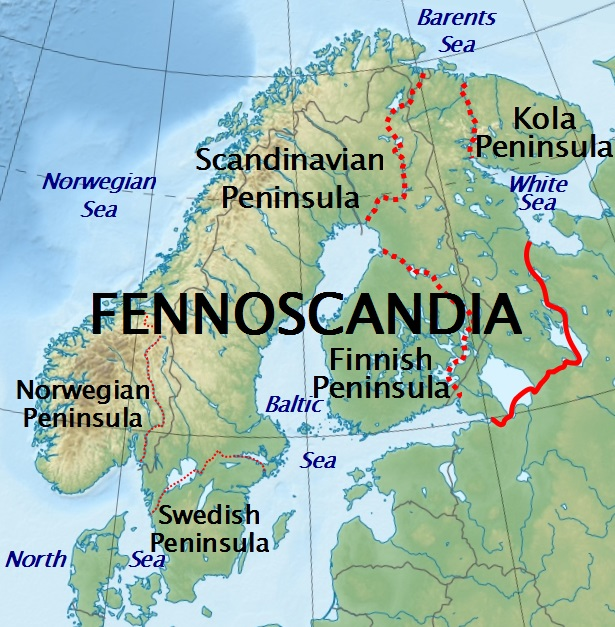

```{r setup, include=FALSE}
BioDataScience2::learnr_setup()
SciViews::R()
library(BioDataScience)
library(kohonen)

# Preparation dataset ------
read("varechem", package = "vegan") %>.%
  rename(., station = rownames) -> envir
```

```{r, echo=FALSE}
BioDataScience2::learnr_banner()
```

```{r, context="server"}
BioDataScience2::learnr_server(input, output, session)
```

----

## Objectif 

Le tutoriel learnr sur les cartes auto-adaptatives (SOM) que vous vous apprêtez à réaliser vous permettra de : 

- comprendre comment réaliser les différentes étapes de la SOM : transformation du jeu de données en matrice, calcul de la SOM et représentation sous forme de différents graphiques. 
- acquérir les outils nécessaires à l'analyse et l'interprétation d'un jeu de données multivariées grâce à la SOM. 

Avant toute chose, assurez vous d'avoir bien compris le contenu du [module 6](https://wp.sciviews.org/sdd-umons2/?iframe=wp.sciviews.org/sdd-umons2-2020/k-moyenne-mds-som.html) du cours et en particulier la [section 6.3](https://wp.sciviews.org/sdd-umons2/?iframe=wp.sciviews.org/sdd-umons2-2020/cartes-auto-adaptatives-som.html). N'oubliez pas de réaliser les exercices H5P qui figurent dans cette section avant de vous lancer dans ce tutoriel Learnr.

## Données environnementales

Des chercheurs ont étudié la composition floristique et les variables environnementales dans des forêts de pins oligotropes (*Pinus sylvestris*) dans l'est de la Fennoscandie, une région située au nord de l'Europe constituée de la Finlande, de la péninsule Scandinave, de la Carélie et de la péninsule de Kola. 



Les 24 sites sélectionnés pour cette étude sont situés dans le nord de la Finlande et dans la péninsule de Kola. Quatorze variables environnementales ont été mésurées sur les différents sites d'étude dont onze permettant d'évaluer la quantité de nutriments présentant dans la matière organique (MO). Les différentes variables mesurées sont présentées dans le tableau ci-dessous.

| label        | description                    | unités     |
|:------------:|:-------------------------------|:-----------|
| **N**        | azote                          | mg/g de MO |
| **P**        | phosphore                      | µg/g de MO |
| **K**        | potassium                      | µg/g de MO |
| **Ca**       | calcium                        | µg/g de MO |
| **Mg**       | magnésium                      | µg/g de MO |
| **S**        | soufre                         | µg/g de MO |
| **Al**       | aluminium                      | µg/g de MO |
| **Fe**       | fer                            | µg/g de MO |
| **Mn**       | manganèse                      | µg/g de MO |
| **Zn**       | zinc                           | µg/g de MO |
| **Mo**       | molybdène                      | µg/g de MO |
| **Baresoil** | sourface estimée de sol nu     | %          |
| **Humdepth** | épaisseur de la couche d'humus | cm         |
| **pH**       | pH du sol                      | -          |

Vous pouvez facilement télécharger ces données depuis `"varechem"` dans le package {vegan} et en visualiser les premières lignes.

```{r}
read("varechem", package = "vegan") %>.%
  rename(., station = rownames) -> envir
head(envir)
```

Pour avoir une idée globale du jeu de données, vous pouvez commencer par utiliser `skim()`.

```{r}
skimr::skim(envir)
```

On constate qu'aucune donnée n'est manquante et que toutes les variables sont numériques à l'exception de la première colonne nommée "station" qui contient les numéros des stations. Il faut donc l'enlever pour la suite de l'étude. Les unités étant différentes, il faudra également standardiser les données. Le tableau devra également être transformé en matrice car la fonction `som()` du package {kohonen} ne peut utiliser que ce type d'objet.

### Transformation en matrice

Transformez votre jeu de données `envir` en matrice. N'oubliez pas de commencer par retirer la colonne correspondant aux numéros de station et de standardiser vos données. 

```{r matrix_h2, exercise=TRUE}
___ %>.%
  ___(., - station) %>.%
  ___(.) %>.%
  ___(.) -> envir_mat
```

```{r matrix_h2-hint-1}
DF %>.%
  select(., - rownames) %>.%
  ___(.) %>.%
  ___(.) -> envir_mat
```

```{r matrix_h2-solution}
envir %>.%
  select(., - rownames) %>.%
  scale(.) %>.%
  as.matrix(.) -> envir_mat
```

```{r matrix_h2-check}
grade_code("Très bien ! Maintenant que vous avez transformé votre jeu de données en matrice après avoir pris soin de retirer les variables non numériques et de le standardiser si nécessaire, vous allez pourvoir rentrer dans le vif du sujet ! ")
```

## Cartes auto-adaptatives (SOM)

Pour réalisez le calcul de votre carte auto-adaptative ou SOM, vous allez devoir utiliser la fonction `som()` du package {kohonen}. Avant de faire le calcul, il est impotant de noter que l'analyse fait intervenir le générateur pseudo-aléatoire. Il peut-être donc intéréssant de le fixer en déterminant un point de départ avec `set.seed()` si vous souhaitez rendre votre analyse reproductible.  

Pour utilser la fonction `som()`, vous devrez lui renseigner une matrice et utiliser l'argument `grid =` avec la fonction `somgrid()` pour lui préciser la topologie de la carte. Cette fonction `somgrid()` nécessite au minimum 3 arguments, le nombre de cellules en x et en y (les dimensions de notre grille) et la topologie, grille rectangulaire ou grille hexagonale, spécifiée par l'argument `topo =` avec pour valeur `"rectangular"` et `"hexagonal"`, respectivement.    

Avec la matrice `envir_mat` mise à votre disposition, calculez la SOM pour une grille hexagonale de 3 par 3. Afficher le résumer de votre objet avec la fonction `summary()`

```{r mat_prep}
envir %>.%
  select(., - rownames) %>.%
  scale(.) %>.%
  as.matrix(.) -> envir_mat
```

```{r som_h3, exercise=TRUE, exercise.setup="mat_prep"}
set.seed(198) # fixe le générateur pseudo-aléatoire. 
envir_som <- ___(___, ___ = ___(___, ___, ___))
___(___)
```

```{r som_h3-hint-1}
set.seed(198) # fixe le générateur pseudo-aléatoire. 
envir_som <- ___(MATRIX, grid = ___(X, Y, ___ = ___))
___(___)
```

```{r som_h3-hint-2}
set.seed(198) # fixe le générateur pseudo-aléatoire. 
envir_som <- ___(envir_mat, grid = ___(3, Y, topo = ___))
___(envir_som)
```

```{r som_h3-solution}
set.seed(198) # fixe le générateur pseudo-aléatoire. 
envir_som <- som(envir_mat, grid = somgrid(3, 3, topo = "hexagonal"))
summary(envir_som)
```

```{r som_h3-check}
grade_code("Et voila ... vous venez de réaliser votre première SOM ! Comme vous le constatez, le résumé de l'objet que vous venez de créer ne vous fournit pas beaucoup d'informations. Pas de panique ! La SOM étant une technique esssentiellement visuelle, c'est en réalisant différents types de graphiques que vous allez obtenir l'information.")
```

### Évolution de l'apprentissage

```{r carte_prep}
envir %>.%
  select(., - rownames) %>.%
  scale(.) %>.%
  as.matrix(.) -> envir_mat
set.seed(198) # fixe le générateur pseudo-aléatoire. 
envir_som <- som(envir_mat, grid = somgrid(3, 3, topo = "hexagonal"))
```

Lors de la réalisation d'une technique visuelle comme la SOM, le plus important c'est de représenter graphiquement la carte. Vous pouvez la réaliser avec des graphiques R de base en utilisant la fonction `plot()`. Il existe plusieurs types de graphiques disponibles, vous pouvez dès lors consulter l'aide en ligne `plot.kohonen` pour en savoir plus. 

Commençez par visualiser l'évolution de l'apprentissage en utilisant l'argument `type = "changes"`. Vous avez à disposition l'objet `envir_som`. 

```{r changes_h2, exercise=TRUE, exercise.setup="carte_prep"}
___(___, ___)
```

```{r changes_h2-hint-1}
___(envir_som, ___ = "changes")
```

```{r changes_h2-solution}
plot(envir_som, type = "changes")
```

```{r changes_h2-check}
grade_code("L’objectif est de réduire le plus possible les distances des stations par rapport aux cellules dans lesquelles elles devraient venir se placer. On cherche donc à être le plus bas possible sur l'axe des ordonnées. Ici, on constate qu'à partir de la 60^ème^ itération, la courbe ne diminue plus de manière significative.")
```

### Stations sur la carte

Vous allez maintenant placer les stations dans la carte. Pour cela, vous devez utiliser l'argument `type = "mapping"`. Afin d'avoir une grille hexagonale, vous pouvez utiliser l'argument `shape = "straight"`. 

Réprésentez cette carte pour `envir_som`. Utilisez l'argument `labels =` pour afficher le numéro des stations disponibles dans la colonne `station` du jeu de données `envir`

```{r mapping_h2, exercise=TRUE, exercise.setup="carte_prep"}
___(___, type = ___, shape = ___, ___ = envir$station)
```

```{r mapping_h2-hint-1}
___(envir_som, type = ___, shape = ___, labels = envir$station)
```

```{r mapping_h2-solution}
plot(envir_som, type = "mapping", shape = "straight", labels = envir$station)
```

```{r mapping_h2-check}
grade_code("Bravo ! Le graphique que vous venez d'obtenir permet de voir comment les stations sont regroupées. Les stations qui sont dans la même cellule ont des caractéristiques environnementales relativement similaires. Les stations regroupées dans les cellules à proximité de la cellule en haut à droite auront des caractérisques environnementales assez proche par contre les stations présentent dans des cellules plus éloignées, en bas à gauche par exemple, seront différentes. Il est possible de visualiser ces différences dans un autre graphique et c'est ce que vous allez faire maintenant.")
```

### Représentation des variables

Les cellules représentent des stations présentants des compositions différentes. La carte SOM étant orientée, il est possible de lui associer des informations relatives aux variables. Le graphique obtenu avec l'argument `type = "codes"` permet la visualisation de ces différences de façon générale. 

Représentez ce graphique pour `envir_som` dans une grille hexagonale et en utilisant l'argument `codeRendering = "segments"` pour représenter les variables. 

```{r codes_h2, exercise=TRUE, exercise.setup="carte_prep"}
___(___, type = ___, codeRendering = ___, shape = ___)
```

```{r codes_h2-hint-1}
___(envir_som, type = "codes", codeRendering = ___, shape = ___)
```

```{r codes_h2-solution}
plot(envir_som, type = "codes", codeRendering = "segments", shape = "straight")
```

```{r codes_h2-check}
grade_code("On remarque sur ce graphique que les stations présentants les concentrations les plus élevées en `P`, `K`, `Ca`, `Mg` et `S` sont sur la droite de la carte alors que les concentrations les plus basses sont à gauche. Les stations en haut de la carte présentent des concentrations plus élevée en `Al` et en `F` contrairement aux stations du bas. L'épaisseur de l'humus est la plus grande pour les stations en bas de la carte de même que la surface de sol nu. Le pH est quant à lui plus élevé dans les stations en haut à droite.")
```

## Conclusion

C'est excellent ! Vous êtes arrivé à la fin de auto-évaluation relative aux cartes auto-adaptative. Vous avez acquis de nouveaux outils vous permettant l'analyse et l'interprétation d'un jeu de données multivariées. Essayez maintenant d'appliquer ces techniques dans une assigantion GitHub.

```{r comm_noscore, echo=FALSE}
question_text(
  "Laissez-nous vos impressions sur cet outil pédagogique",
  answer("", TRUE, message = "Pas de commentaires... C'est bien aussi."),
  incorrect = "Vos commentaires sont enregistrés.",
  placeholder = "Entrez vos commentaires ici...",
  allow_retry = TRUE
)
```
