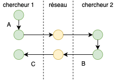
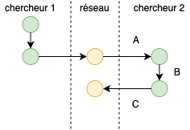
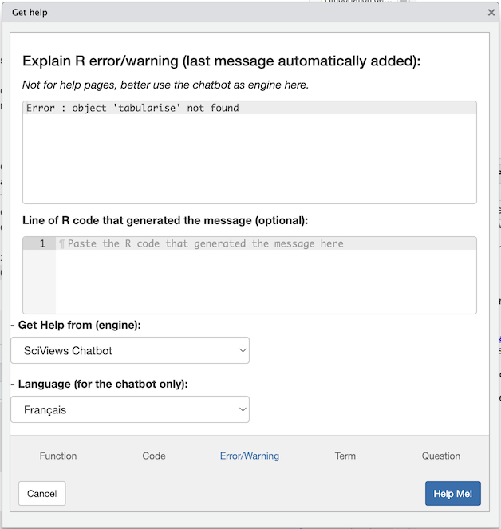

```{r setup, include=FALSE}
BioDataScience2::learnr_setup()
SciViews::R("model", "infer", lang = "fr")
# Required for RSConnect
# SciViews::R
library(rlang)
library(data.table)
library(ggplot2)
library(tibble)
library(tidyr)
library(dplyr)
library(dtplyr)
library(broom)
library(forcats)
library(collapse)
library(fs)
library(data.trame)
library(svFast)
library(svTidy)
library(svMisc)
library(svBase)
library(svFlow)
library(data.io)
library(chart)
library(tabularise)
library(SciViews)
# ... more
library(readxl)
library(testthat)
library(equatags)
# 'model' and 'infer' packages
library(modelit)
library(distributional)
library(inferit)

# datasets
## crabs
crabs <- read("crabs", package = "MASS")

## potatoes : données générées sur base d'un article 
set.seed(42)
potatoes <- dtx(
  id       = paste0(letters, sample.int(46, replace = FALSE)),
  yield    = c(rnorm(18L, mean = 33.6, sd = 4),
               rnorm(28L, mean = 39.5, sd = 4)), 
  cultivar = c(rep("bintje", times = 18L), rep("fontane", times = 28L))
)
potatoes <- labelise(potatoes,
  label = list(
    id       = "Code d'identification",
    yield    = "Rendement",
    cultivar = "Variété"), 
  units = list(yield = "t/ha"))

## bull
read(file = system.file("extdata", "belgianblue.xlsx",
  package = "BioDataScience2"), type = "xlsx") %>.%
  labelise(.,
    label = list(
      weight  = "Masse",
      age     = "Age",
      variety = "Variété"),
    units = list(
      weight   = "kg",
      age      = "mois")) %->%
  bull

bull %>.%
  sfilter(., age <= 50) %>.%
  smutate(., weight_std = labelise(weight/age,
    label = "Masse standardisée", units = NA)) %->%
  bull_red
```

```{r, echo=FALSE}
BioDataScience2::learnr_banner()
```

```{r, context="server"}
BioDataScience2::learnr_server(input, output, session)
```

------------------------------------------------------------------------

## Objectifs

Ce cours de **Science des données II : analyse et modélisation** fait suite au cours de **Science des données I : visualisation et inférence**. Ils sont disponibles à partir de <https://wp.sciviews.org/>. Ce tutoriel vise à :

-   Réviser les notions essentielles du cours de Science des données I
-   Découvrir quelques nouveautés liées à la SciViews Box 2025

Le cours de Science des données I se divise en deux parties. La première partie traite principalement de la réalisation de graphiques et du remaniement des données. La seconde partie s'intéresse aux probabilités, aux distributions statistiques les plus courantes en biologie ainsi qu'aux tests d'inférence (test *t* de Student, test de Wilcoxon, ANOVA, test de Kruskal-Wallis...).

La matière est bien trop vaste pour revoir tous les concepts du premier cours en un seul tutoriel. Une synthèse des éléments principaux va vous permettre de retrouver vos marques. N'hésitez pas à réviser les parties du cours 1, si cela s'avère nécessaire.

## Logiciels

Commencez par vous assurer que vous rappelez du rôle des différents logiciels que nous employons dans le cadre de ce cours. Si vous avez des doutes à ce sujet, consultez le premier module de cours de [science des données 1](https://wp.sciviews.org/sdd-umons/?iframe=wp.sciviews.org/sdd-umons-2025/outils.html). Répondez aux questions ci-dessous.

```{r qu_intro}
quiz(
  question("Définissez 'RStudio'",
    answer("Un environnement de développement intégré", correct = TRUE),
    answer("Un logiciel de gestion de versions"),
    answer("Un service web d'hébergement de projet"),
    answer("Un langage avec une syntaxe facile à lire et à écrire"),
    answer("Aucune des réponses proposées n'est correcte"),
    allow_retry = TRUE, random_answer_order = TRUE,
    correct = "Bravo ! Vous avez trouvé la bonne réponse. RStudio est un environnement complet et optimisé pour réaliser vos analyses, vos graphiques et vos rapports.",
    incorrect = "Attention, Ce n'est pas la bonne réponse. Ces outils sont présentés dans le premier module du cours de SDD I.",
    submit_button = "Soumettre une réponse",
    try_again_button = "Resoumettre une réponse"),
  question("Définissez 'Git'",
    answer("Un environnement de développement intégré"),
    answer("Un logiciel de gestion de versions", correct = TRUE),
    answer("Un service web d'hébergement de projet"),
    answer("Un langage avec une syntaxe facile à lire et à écrire"),
    answer("Aucune des réponses proposées n'est correcte"),
    correct = "Excellent ! Git est un gestionnaire de version très employé par les *data scientist*.",
    incorrect = "Attention, ce n'est pas la bonne réponse. Ces outils sont présentés dans le premier module du cours de SDD I.",
    allow_retry = TRUE, random_answer_order = TRUE,
    submit_button = "Soumettre une réponse",
    try_again_button = "Resoumettre une réponse"),
  question("Définissez 'GitHub'",
    answer("Un environnement de développement intégré"),
    answer("Un logiciel de gestion de versions"),
    answer("Un service web d'hébergement de projet", correct = TRUE),
    answer("Un langage avec une syntaxe facile à lire et à écrire"),
    answer("Aucune des réponses proposées n'est correcte"),
    correct = "Mais oui bien sûr. GitHub est un réseau social centré sur un gestionnaire de versions de projet.",
    incorrect = "Pas vraiment, allez, réfléchissez bien...",
    allow_retry = TRUE, random_answer_order = TRUE,
    submit_button = "Soumettre une réponse",
    try_again_button = "Resoumettre une réponse"),
  question("Définissez 'Markdown'",
    answer("Un environnement de développement intégré"),
    answer("Un logiciel de gestion de versions"),
    answer("Un service web d'hébergement de projet"),
    answer("Un système de balisage de texte", correct = TRUE),
    answer("Aucune des réponses proposées n'est correcte"),
    correct = "Impeccable. Markdown est bien un système qui permet le formattage de texte via des balises. Sa syntaxe est facile à lire et à écrire. Il permet de s'intéresser uniquement au fond et pas à la forme. Cela permet d'augmenter grandement votre productivité. Ce langage est également utilisé dans les issues GitHub.",
    incorrect = "Cela est incorrect, désolé !",
    allow_retry = TRUE, random_answer_order = TRUE,
    submit_button = "Soumettre une réponse",
    try_again_button = "Resoumettre une réponse")
)
```

## Git et GitHub

Nous utilisons abondamment Git et GitHub. Révisons maintenant la terminologie spécifique associée à ces outils de gestion de version. Elle est présentée dans les deux premiers modules du cours de [science des données 1](https://wp.sciviews.org/sdd-umons/?iframe=wp.sciviews.org/sdd-umons-2025/outils.html).

### Situation 1

Deux chercheurs, distants de plusieurs centaines de kilomètres, collaborent sur un projet commun. Ils ont pour cela décidé d'employer git et GitHub.

Sur base du schéma ci-dessous où chaque cercle de couleur correspond à un état du système de gestion de version, répondez aux questions suivantes.



```{r qu_git1}
quiz(
  question("Qualifiez l'action **A**",
    answer("commit", correct = TRUE, message = "Un commit permet d'enregistrer une version du projet."),
    answer("clone", message = "Un *clone* permet de créer un double local d’un dépôt GitHub."),
    answer("push", message = "Un *push* permet d'envoyer ses modifications locales vers le dépôt GitHub. Dans RStudio, vous pouvez retrouver une flêche verte relative à cette action dans l'onglet `git`."),
    answer("pull", message = "Un *pull* permet de rapatrier les modifications que les autres utilisateurs ont appliqué dans le dépôt GitHub vers sa propre version locale. Dans RStudio, vous pouvez retrouver une flêche bleue relative à cette action dans l'onglet `git`."),
    answer("fetch", message = "Un *fetch* permet de faire un pull et un push successivement."),
    answer("fork", message = "Un *fork* permet de faire une copie dans notre propre compte GitHub d'un dépôt sur GitHub."),
    answer("pull request", message = "Un *pull request* permet de suggérer à l’auteur du dépôt d'orgine que vous avez fait des modifications qui pourraient l’intéresser. L'auteur peut accepter ou refuser ces modifications."),
    allow_retry = TRUE, random_answer_order = TRUE,
    correct = "Bien vu. Le commit sert à enregistrer une nouvelle version de votre dépôt GitHub",
    incorrect = "Attention, Ce n'est pas la bonne réponse. Toutes ces notions ne sont pas simples. Prennez le temps de réviser la section sur Git et sur GitHub",
    submit_button = "Soumettre une réponse",
    try_again_button = "Resoumettre une réponse"
    ),
  question("Qualifiez l'action **B**",
    answer("commit", message = "Un *commit* permet d'enregistrer une version du projet."),
    answer("clone", message = "Un *clone* permet de créer un double local d’un dépôt GitHub."),
    answer("push", correct = TRUE, message = "Un *push* permet d'envoyer ses modifications locales vers le dépôt GitHub. Dans RStudio, vous pouvez retrouver une flêche verte relative à cette action dans l'onglet `git`."),
    answer("pull", message = "Un *pull* permet de rapatrier les modifications que les autres utilisateurs ont appliqué dans le dépôt GitHub vers sa propre version locale. Dans RStudio, vous pouvez retrouver une flêche bleue relative à cette action dans l'onglet `git`."),
    answer("fetch", message = "Un *fetch* permet de faire un pull et un push successivement."),
    answer("fork", message = "Un *fork* permet de faire une copie dans notre propre compte GitHub d'un dépôt sur GitHub."),
    answer("pull request", message = "Un *pull request* permet de suggérer à l’auteur du dépôt d'orgine que vous avez fait des modifications qui pourraient l’intéresser. L'auteur peut accepter ou refuser ces modifications."),
    allow_retry = TRUE, random_answer_order = TRUE,
    correct = "Excellent ! Le push (pousser) correspond à l'envoi des modifications locales dans le dépôt GitHub pour le synchroniser.",
    incorrect = "Et bien non, désolé. Une petite révision de la section sur Git et sur GitHub du cours 1 s'impose peut-être ?",
    submit_button = "Soumettre une réponse",
    try_again_button = "Resoumettre une réponse"
    ),
  question("Qualifiez l'action **C**",
    answer("commit", message = "Un *commit* permet d'enregistrer une version du projet."),
    answer("clone", message = "Un *clone* permet de créer un double local d’un dépôt GitHub."),
    answer("push", message = "Un *push* permet d'envoyer ses modifications locales vers le dépôt GitHub. Dans RStudio, vous pouvez retrouver une flêche verte relative à cette action dans l'onglet `git`."),
    answer("pull", correct = TRUE, message = "Un *pull* permet de rapatrier les modifications que les autres utilisateurs ont appliqué dans le dépôt GitHub vers sa propre version locale. Dans RStudio, vous pouvez retrouver une flêche bleue relative à cette action dans l'onglet `git`."),
    answer("fetch", message = "Un *fetch* permet de faire un pull et un push successivement."),
    answer("fork", message = "Un *fork* permet de faire une copie dans notre propre compte GitHub d'un dépôt sur GitHub."),
    answer("pull request", message = "Un *pull request* permet de suggérer à l’auteur du dépôt d'orgine que vous avez fait des modifications qui pourraient l’intéresser. L'auteur peut accepter ou refuser ces modifications."),
    allow_retry = TRUE, random_answer_order = TRUE,
    correct = "Très bien. Le pull (tirer) est l'action inverse du push : la récupération dans la version locale des modifications qui se trouvent dans le dépôt GitHub. Faites un pull d'abord et un push ensuite pour synchroniser complètement votre version locale avec celle sur GitHub.",
    incorrect = "Non, désolé. Git et sur GitHub, c'est important, revoyez la matière...",
    submit_button = "Soumettre une réponse",
    try_again_button = "Resoumettre une réponse"
    )
)
```

### Situation 2

Le chercheur 2 vient d'intégrer le projet que le chercheur 1 réalisait seul. Il doit donc acquérir une copie du dépôt pour la première fois sur sa machine avant de pouvoir contribuer à ce projet. Sur base du schéma ci-dessous qui représente le travail des deux chercheurs, répondez aux questions suivantes.



```{r qu_git3}
quiz(
  question("Qualifiez l'action **A**",
    answer("commit", message = "Un *commit* permet d'enregistrer une version du projet."),
    answer("clone", correct = TRUE, message = "Un *clone* permet de créer un double local d’un dépôt GitHub."),
    answer("push", message = "Un *push* permet d'envoyer ses modifications locales vers le dépôt GitHub. Dans RStudio, vous pouvez retrouver une flêche verte relative à cette action dans l'onglet `git`."),
    answer("pull", message = "Un *pull* permet de rapatrier les modifications que les autres utilisateurs ont appliqué dans le dépôt GitHub vers sa propre version locale. Dans RStudio, vous pouvez retrouver une flêche bleue relative à cette action dans l'onglet `git`."),
    answer("fetch", message = "Un *fetch* permet de faire un pull et un push successivement."),
    answer("fork", message = "Un *fork* permet de faire une copie dans notre propre compte GitHub d'un dépôt sur GitHub."),
    answer("pull request", message = "Un *pull request* permet de suggérer à l’auteur du dépôt d'orgine que vous avez fait des modifications qui pourraient l’intéresser. L'auteur peut accepter ou refuser ces modifications."),
    allow_retry = TRUE, random_answer_order = TRUE,
    correct = "Impeccable. Vous clonez un dépôt lorsque vous créez pour la première fois une image de ce dépôt depuis GitHub vers votre machine locale. Avec RStudio, vous le faites généralement lors de la création d'un nouveau projet à partir du lien copié depuis GitHub.",
    incorrect = "Attention, Ce n'est pas la bonne réponse. Toutes ces notions ne sont pas simples. Prennez le temps de réviser la section sur Git et sur GitHub du cours de SDD I.",
    submit_button = "Soumettre une réponse",
    try_again_button = "Resoumettre une réponse"
    ),
  question("Qualifiez l'action **B**",
    answer("commit", correct = TRUE, message = "Un *commit* permet d'enregistrer une version du projet."),
    answer("clone", message = "Un *clone* permet de créer un double local d’un dépôt GitHub."),
    answer("push", message = "Un *push* permet d'envoyer ses modifications locales vers le dépôt GitHub. Dans RStudio, vous pouvez retrouver une flêche verte relative à cette action dans l'onglet `git`."),
    answer("pull", message = "Un *pull* permet de rapatrier les modifications que les autres utilisateurs ont appliqué dans le dépôt GitHub vers sa propre version locale."),
    answer("fetch", message = "Un *fetch* permet de faire un pull et un push successivement."),
    answer("fork", message = "Un *fork* permet de faire une copie dans notre propre compte GitHub d'un dépôt sur GitHub."),
    answer("pull request", message = "Un *pull request* permet de suggérer à l’auteur du dépôt d'orgine que vous avez fait des modifications qui pourraient l’intéresser. L'auteur peut accepter ou refuser ces modifications."),
    allow_retry = TRUE, random_answer_order = TRUE,
    correct = "Oui, à nouveau un commit ici.",
    incorrect = "Non, désolé. Revoyez le vocabulaire associé à Git et GitHub dans le module 1 du premier cours.",
    submit_button = "Soumettre une réponse",
    try_again_button = "Resoumettre une réponse"
    ),
  question("Qualifiez l'action **C**",
    answer("commit", message = "Un *commit* permet d'enregistrer une version du projet."),
    answer("clone", message = "Un *clone* permet de créer un double local d’un dépôt GitHub."),
    answer("push", correct = TRUE, message = "Un *push* permet d'envoyer ses modifications locales vers le dépôt GitHub. Dans RStudio, vous pouvez retrouver une flêche verte relative à cette action dans l'onglet `git`."),
    answer("pull", message = "Un *pull* permet de rapatrier les modifications que les autres utilisateurs ont appliqué dans le dépôt GitHub vers sa propre version locale. Dans RStudio, vous pouvez retrouver une flêche bleue relative à cette action dans l'onglet `git`."),
    answer("fetch", message = "Un *fetch* permet de faire un pull et un push successivement."),
    answer("fork", message = "Un *fork* permet de faire une copie dans notre propre compte GitHub d'un dépôt sur GitHub."),
    answer("pull request", message = "Un *pull request* permet de suggérer à l’auteur du dépôt d'orgine que vous avez fait des modifications qui pourraient l’intéresser. L'auteur peut accepter ou refuser ces modifications."),
    allow_retry = TRUE, random_answer_order = TRUE,
    correct = "Et oui, c'est un push, effectivement.",
    incorrect = "Incorrect, malheureusement, Une révision de la section sur Git et sur GitHub s'impose.",
    submit_button = "Soumettre une réponse",
    try_again_button = "Resoumettre une réponse"
    )
)
```

## Chargement des packages

La fonction`SciViews::R()` est employée pour charger une série de packages qui forment le "dialecte" SciViews-R. **Nous l'utilisons en début de script R ou encore dans le premier chunk d'un rapport d'analyse au format R Markdown.**

Les packages chargés offrent des fonctionnalités qui permettent d'importer, remanier et visualiser vos données à l'aide de graphiques et de tableaux en limitant le recours à la fonction `library()` pour charger des packages R supplémentaires (mais vous pourriez être amené à le faire occasionnellement).

Exécutez l'instruction `SciViews::R()` suivie de l'instruction `SciViews_packages()` dans la console R ci-dessous et analysez le résultat obtenu. Pour rappel, vous exécutez et testez votre code avec le bouton `Run Code` et vous soumettez votre réponse avec le bouton `Submit Answer`. Utilisez autant de fois que nécessaire `Run Code` sans pénalité, mais n'oubliez surtout pas de soumettre à la fin avec `Submit Answer`.

```{r sciviews, exercise=TRUE}

```

```{r sciviews-solution}
SciViews::R()
SciViews_packages()
```

```{r sciviews-check}
grade_code("Voilà effectivement un exercice simple clôturé grâce à `Submit Answer`.")
```

```{r qu_sciviews}
question("Sélectionnez parmi les propositions suivantes les packages chargés avec l'instruction `SciViews::R()`",
  answer("chart", correct = TRUE),
  answer("tidyverse"),
  answer("data.trame", correct = TRUE),
  answer("data.io", correct = TRUE),
  answer("collapse", correct = TRUE),
  allow_retry = TRUE, random_answer_order = TRUE,
  correct = "C'était une petite question d'échauffement liée à la lecture de sortie R.",
  incorrect = "Attention, relisez attentivement le résultat renvoyé par `SciViews_packages()`. Plusieurs éléments sont à sélectionner.",
  submit_button = "Soumettre une réponse", try_again_button = "Resoumettre une réponse"
    )
```

Des packages supplémentaires peuvent être chargés grâce à `SciViews::R()`. Ils correspondent à des sections complémentaires qui ne sont pas chargées de base, par exemple, `"model"` pour la modélisation, `"infer"` pour l'inférence, `"explore"` pour l'analyse multivariée. Il est également possible de définir le langage par défaut pour l'importation de données qui supportent plusieurs langages et pour les labels automatiques des axes des graphiques ou des colonnes de tableaux avec l'argument `lang=`.

Vous remarquerez que l'instruction `SciViews::R` ne génère plus de sortie à présent. Avant, vous aviez un long listing des packages changés et ensuite des conflits entre fonctions. Ceci est rendu silencieux mais vous pouvez toujours préciser l'argument `silent = FALSE`, donc avec `SciViews::R(silent = FALSE)` pour retrouver le rapport auquel vous êtes habitué.

```{r, echo=TRUE, eval=FALSE}
SciViews::R("model", lang = "fr")
```

## Importation des données

Dans SciViews-R, la fonction `read()` se charge de l'importation de données depuis les packages R (argument `package=`), depuis le disque dur, ou depuis Internet. Consultez la page d'aide de cette fonction pour en découvrir d'autres arguments utiles en entrant `?read` à la console R.

Importez le tableau nommé `crabs` qui provient du package {MASS}. **rappel : lorsqu'un exercice comporte du code avec des zones à remplacer (`___`), ne faites rien d'autre que compléter ces zones. Les outils d'autocorrection sont très sensibles et n'apprécieraient pas autrement.**

```{r read_h2, exercise=TRUE, eval=FALSE}
crabs <- read(___, package = ___)
# Tableau partiel 
tabularise$headtail(crabs)
```

```{r read_h2-hint-1, eval=FALSE}
# Consultez la page d'aide de read(). 
# Elle est disponible en exécutant l'instruction `?` ou encore `.?` dans la console R.
crabs <- read(___, package = ___)
# Tableau partiel 
tabularise$headtail(crabs)

 #### ATTENTION: Hint suivant = solution !####
```

```{r read_h2-solution}
## Solution ##
crabs <- read("crabs", package = "MASS")
# Formatage du tableau crabs
tabularise$headtail(crabs)
```

```{r read_h2-check}
grade_code("Vous venez d'importer un tableau de données",
  "La réponse n'est pas correcte. Ne complètez que les élèments manquants marqués ___. Lisez bien l'énoncé.")
```

<!-- {width="30%"} -->

Depuis la SciViews Box 2024, vous avez un nouvel "addin" dans RStudio, nommé **"Help"**.


Il donne accès à diverses pages d'aides relatives aux fonctions R, au code, aux messages d'erreurs ou plus généralement à des termes statistiques, voir n'importe quelle question que vous vous posez. Vous pouvez utilise l'aide de R (**Help pages**), mais aussi interroger un moteur LLM de type ChatGPT spécialement entrainé pour répondre à des questions de statistique, de science des données ou relatives au langage R (**SciViews chatbot**), aussi bien en anglais qu'en français. Enfin, vous pourrez aussi interroger Internet avec un moteur de recherche spécialisé pour R (**Rseek**), dans un forum autour de questions de programmation (**Stack Overflow**), ou plus généralement à l'aide des moteurs **Google**, **Bing** ou **DuckDuckGo**.



**Le chatbot SciViews ne connait que les fonctions et la syntaxe R de base ou tidyverse. Il ne connait pas le dialecte SciViews-R. Mais dans les exercices, nous vous demandons d'utiliser ce dernier sous peine de pénalité dans les exercices. Il vous faudra donc convertir le code renvoyé par ce chatbot, ou n'importe quel autre moteur LLM en code SciViews-R.** Ceci à titre didactique pour bien montrer que vous *comprenez* votre code et que vous ne copiez-collez pas "bêtement" un résultat renvoyé par un moteur LLM (bien entendu, hors de ce cours, vous êtes libre d'utiliser la syntaxe R qui vous plait). Dans la suite de ce tutoriel learnr, nous allons revenir sur les spécificités du dialecte SciViews-R pour vous rafraîchir la mémoire à ce sujet.

Le package {tabularise} est disponible dans la SciViews Box 2025. Il offre une fonction centrale que vous devez retenir `tabularise()`. Elle permet d'obtenir des tableaux bien formatés pouvant être ajoutés à vos carnets de notes et vos rapports. Cette fonction utilise la logique suivante : `tabularise$xxx(objet)`. En fonction du type indiqué dans `xxx` et de la classe de l'objet, vous obtiendrez un tableau spécifique. Dans l'exemple ci-dessus, vous avez employé le type `headtail` qui permet d'afficher le début et la fin de votre tableau de données.

La fonction `read()` permet d'importer un nombre important de formats de fichiers. Avec l'instruction suivante, vous pouvez retrouver tous les formats supportés par la fonction `read()` (et par son pendant pour exporter vos données, la fonction `write()`).

```{r, echo=TRUE}
data_types(view = FALSE)
```

Analysez l'organisation des fichiers ci-dessous. Le dossier `sharks-GuyliannEngels` contient tous les documents employés pour réaliser une analyse sur le recensement des attaques de requins en Australie. Il s'agit d'un [projet RStudio](https://wp.sciviews.org/sdd-umons/?iframe=wp.sciviews.org/sdd-umons-2025/rs.html). Ce projet doit absolument être portable. Il faut donc employer uniquement des **chemins relatifs**. Par exemple, le document `sharks_report.qmd` se trouve dans le dossier `docs`.

    /home
      /sv
        /shared
          /projects
            /sharks-GuyliannEngels         # Répertoire de base du projet
              .gitignore                   # Fichier lié à la gestion de version
              /data                        # Dossier avec les données
                sharks.csv                 # Fichier d'un jeu de données
              /docs                        # Dossier avec les analyses
                sharks_report.qmd          # Fichier rapport au format Quarto
              /R                           # Dossier avec les scripts d'analyse
                sharks_import.R            # Script R nommé sharks_import.R
              sharks-GuyliannEngels.Rproj  # Fichier de configuration de RStudio

```{r qu_read}
quiz(
  question("Depuis le fichier sharks_report.qmd, Sélectionnez l'instruction R correcte pour lire le jeu de données `sharks.csv`.",
    answer("sharks <- read(\"../data/sharks.csv\")", correct = TRUE),
    answer("sharks <- read(\"sharks.csv\")"),
    answer("sharks <- read(\"data/sharks.csv\")"), 
    answer("sharks <- read(\"../../data/sharks.csv\")"),
    answer("sharks <- read(\"../data/sharks_import.R\")"),
    allow_retry = TRUE, random_answer_order = TRUE,
    submit_button = "Soumettre une réponse", try_again_button = "Resoumettre une réponse",
    correct = "Bravo ! Ce n'est pas évident de déterminer le chemin d'accès correct. Le chemin est relatif par rapport au dossier qui contient le document Quarto cible.",
    incorrect = "Attention, jongler avec les chemins d'accès relatifs n'est pas simple. Nous vous conseillons de réviser l'annexe proposée ci-dessous."
    ),
  question("Depuis le fichier sharks_import.R, Sélectionnez l'instruction R correcte afin de lire le jeu de données `sharks.csv`.",
    answer("sharks <- read(\"../data/sharks.csv\")"),
    answer("sharks <- read(\"sharks.csv\")"),
    answer("sharks <- read(\"data/sharks.csv\")", correct = TRUE),
    answer("sharks <- read(\"../../data/sharks.csv\")"),
    answer("sharks <- read(\"../data/sharks_import.R\")"),
    allow_retry = TRUE, random_answer_order = TRUE,
    submit_button = "Soumettre une réponse", try_again_button = "Resoumettre une réponse",
    correct = "Le script R utilise comme point de départ le dossier de base du projet RStudio, contrairement au fichier Quarto qmd qui part du dossier qui le contient.",
  incorrect = "Ce n'est pas juste. Révisez les chemins relatifs dans les projets RStudio."
    )
  )
```

La [section 4.1 du cours de SDD I](https://wp.sciviews.org/sdd-umons/?iframe=wp.sciviews.org/sdd-umons-2025/importation.html) traite de l'importation des données dans R. Relisez cette dernière au besoin.

-   Rappel concernant les types de fichiers : les blocs-notes et les rapports sont rédigés sous forme de documents **[Quarto](https://quarto.org)** (certains peuvent néanmoins être au format R Markdown). L'extension de fichier est `.qmd` (contre `.Rmd` pour R Markdown). Il y a relativement peu de différences dans l'utilisation de ces deux formats, à part dans l'entête YAML. Cet entête étant en grande partie prérédigé pour vous dans les projets, ce n'est pas un problème !

-   Par rapport à l'exercice ci-dessus, vous remarquerez que les blocs-notes et les rapports ne seront pas dans un sous-dossier `/docs` dans vos projets, mais directement à la racine. Deux raisons à cela : étant les documents clés du projet, ils sont plus facilement gérés depuis sa racine, et seconde raison, le dossier courant du document Quarto est ainsi le même que le dossier courant du projet (à la console R). C'est plus facile à gérer (chemins relatifs identiques pour les scripts R et les rapports, cf. exercice juste au-dessus qui rappelle le piège lorsque le fichier Quarto est dans un sous-dossier du projet) !

-   Et tant que nous évoquons la rédaction de rapport, n'oubliez pas d'utiliser abondamment `tabularise()` pour obtenir de beaux tableaux, ainsi que les fonctions pour générer des équations mathématiques (fonctions `equation()`, `eq_()` et `eq__()`). Vous les utiliserez dans le cadre de vos régressions linéaires...

Voici par exemple un tableau de l'analyse de variance avec `tabularise` :

```{r, echo=TRUE, warning=FALSE}
SciViews::R("model") # La section 'model' est nécessaire pour les extensions ANOVA
# Préparation des données
tg <- read("ToothGrowth", package = "datasets")
tg$dose <- as.factor(tg$dose)
# ANOVA à deux facteurs
tg_anova <- anova(lm(data = tg, len ~ supp * dose))
# Tableau de l'ANOVA avec tabularise
tabularise(tg_anova, lang = "fr")
```

## Visualisation des données

Les graphiques dans R peuvent être de différents types : des graphiques R de base, {lattice} ou {ggplot2}. Une comparaison des moteurs graphiques est réalisée dans la [section 3.5 du cours de SDD I](https://wp.sciviews.org/sdd-umons/?iframe=wp.sciviews.org/sdd-umons-2025/moteursgraphiques.html). Dans SciViews-R, nous vous proposons d'employer la fonction `chart()` qui permet de réaliser des graphiques avec l'un de ces trois moteurs. Cependant, par défaut, il s'agit de graphiques {ggplot2} auxquels nous ajoutons une série de couches avec l'opérateur `+`.

```{r, echo=TRUE}
# Importation des données
crabs <- read("crabs", package = "MASS")

chart(data = crabs, length ~ width %col=% sex | species) +
  geom_point()
```

Il n'est pas aisé de se souvenir du nom de chaque fonction que l'on peut employer avec `chart()` ou `ggplot()`. Il existe, pour ce faire, une syntaxe alternative. La fonction `Sgg$` associée au pipe natif de R `|>` permet d'obtenir une liste de toutes les fonctions disponibles que l'on peut ajouter au graphique. Le pipe `|>` va remplacer le `+` que l'on suit par `Sgg$` et une liste de complétion apparaît. Il s'agit des fonctions habituelles comme `geom_point()` par exemple :

```{r, echo = TRUE}
chart(data = crabs, length ~ width %col=% sex | species) |>
  Sgg$geom_point()
```

**Attention !** Il n'est pas possible d'intervertir le `+` et `|>` dans chaque situation. Le pipe natif de R `|>` se combine uniquement avec `Sgg$`.

```{r, echo=TRUE, eval=FALSE}
# Mauvaise forme 
chart(data = crabs, length ~ width %col=% sex | species) |>
  geom_point()
```

Reproduisez le graphique suivant en utilisant la syntaxe `Sgg()`. Il s'agit de boites à moustaches (*boxplot*, en anglais).

```{r}
# Importation des données
crabs <- read("crabs", package = "MASS")
# Graphique
chart(data = crabs, length ~ sex %fill=% species) +
  geom_boxplot()
```

Les variables à votre disposition sont les suivantes :

`r paste0("<code>", names(crabs), "</code>")`

```{r chart_h4, exercise=TRUE, eval=FALSE}
# Importation des données
crabs <- read("crabs", package = "MASS")
# Graphique
chart(data = ___, ___ ~ ___ %___=% ___ ) ___
  Sgg$___
```

```{r chart_h4-hint-1, eval=FALSE}
# Importation des données
crabs <- read("crabs", package = "MASS")
# Graphique
chart(data = ___, ___ ~ ___ %___=% ___ ) |>
  Sgg$geom____
```

```{r chart_h4-hint-2, eval=FALSE}
# Importation des données
crabs <- read("crabs", package = "MASS")
# Graphique
chart(data = ___, length ~ ___ %___=% ___ ) |>
  Sgg$geom_b___
```

```{r chart_h4-hint-3, eval=FALSE}
# Importation des données
crabs <- read("crabs", package = "MASS")
# Graphique
chart(data = crabs, length ~ ___ %fill=% ___ ) |>
  Sgg$geom_box___

 #### ATTENTION: Hint suivant = solution !####
```

```{r chart_h4-solution}
## Solution ##
# Importation des données
crabs <- read("crabs", package = "MASS")
# Graphique
chart(data = crabs, length ~ sex %fill=% species) |>
  Sgg$geom_boxplot()
```

```{r chart_h4-check}
grade_code("Vous êtes capable d'employer la formule dans chart() ainsi que le bon geom_* pour obtenir des boites à moustaches.")
```

```{r qu_chart}
question("Sélectionnez parmi les éléments suivants, les descriptions graphiques correctes. (Plusieurs éléments peuvent être cochés).",
  answer("Les médianes des longueurs des carapaces des crabes orange sont supérieures aux crabes bleus.", correct = TRUE),
  answer("Les moyennes des longueurs des carapaces des crabes orange sont supérieures aux crabes bleus."),
  answer("Les espaces interquartiles sont similaires entre les quatre groupes.",correct = TRUE),
  answer("Les écart-types sont similaires entre les quatre groupes."),
  allow_retry = TRUE, random_answer_order = TRUE,
  submit_button = "Soumettre une réponse", try_again_button = "Resoumettre une réponse",
  correct = "Bien joué. Cependant, la description n'est pas complète. Elle peut être améliorée à l'aide de valeurs numériques par exemple.",
  incorrect = "Attention, n'auriez vous pas mélangé les descripteurs paramétriques et les descripteurs non paramétriques. La boite de dispersion présente les descripteurs non paramétriques. La section 3.3 de SDD I traite spécifiquement des boites à moustaches.")
```

Les modules 1 à 3 du cours [SDD I](https://wp.sciviews.org/sdd-umons) traitent de la réalisation des graphiques dans R avec `chart()`. Relisez cette partie si vous avez oublié comment réaliser un graphique avec SciViews-R.

## Remaniement des données

Le remaniement de données est indispensable car vos données sont rarement présentées d'emblée comme elles devraient l'être pour une analyse propre. Vous devez être capable de détecter les valeurs manquantes, de filtrer des observations, de sélectionner des colonnes d'intérêt, de calculer de nouvelles variables, etc.

Dans la SciViews Box 2025, l'utilisation des **data.frame**s, **data.table**s et **tibble**s, trois objets très similaires pour représenter un jeu de données, est remplacée par les **data.trame**s qui sont une forme hybride de data frame. En pratique, cela ne change rien au niveau du remaniement des données, car vos fonctions habituelles telles que `sfilter()`, `sselect()`, `smutate()`... fonctionnent de manière identique. 

Voici un petit exercice de remaniement de données pour vous remémorer comme faire... Vous allez vous intéresser au rendement de deux variétés de pommes de terre : la bintje et la fontane. Après 110 jours de culture, des prélèvements sont effectués dans différentes parcelles en Belgique. La production, exprimée en tonnes par hectare, est ainsi quantifiée pour les deux variétés de pommes de terre. Cet exercice utilise des données générées artificiellement, mais qui s'inspirent des observations relayées sur le site du sillon belge d'un [article consulté le 3 septembre 2019](https://www.sillonbelge.be/4731/article/2019-08-28/bintje-et-fontane-apres-110-115-jours-faute-de-casser-la-baraque-ces-deux).

```{r, warning=FALSE, message=FALSE}
set.seed(42)
potatoes <- dtx(
  id       = paste0(letters, sample.int(46, replace = FALSE)),
  yield    = c(rnorm(18L, mean = 33.6, sd = 4),
               rnorm(28L, mean = 39.5, sd = 4)), 
  cultivar = c(rep("bintje", times = 18L), rep("fontane", times = 28L))
)
potatoes <- labelise(potatoes, 
  label = list(
    id       = "Code d'identification",
    yield    = "Rendement",
    cultivar = "Variété"), 
  units = list(
    yield = "t/ha"))
```

Le tableau de données se nomme `potatoes`. Ce tableau est constitué des variables suivantes :

`r paste0("<code>", names(potatoes), "</code>")`

Les premières et dernières lignes du tableau sont affichées ci-dessous:

```{r, echo=TRUE}
tabularise$headtail(potatoes)
```

Pour fixer les idées, nous pouvons décider de regrouper les fonctions de R en familles selon leur comportement. Les fonctions d'une même famille ont un comportement similaire du point de vue des arguments qu'elles acceptent, du type d'objet qu'elles utilisent et de la façon de renvoyer les résultats.

Le [Tidyverse](https://www.tidyverse.org) propose un ensemble de fonctions cohérentes autour des objets **tibble**s. Ce sont les fonctions comme `mutate()`, `select()`, `filter()`, `group_by()`, `summarise()`, `pivot_longer()`,... Nous appellerons cette famille les **fonctions tidy**.

Dans SciViews::R, il existe des fonctions jumelles aux précédentes qui se comportent de manière très proche et qui réalisent le même traitement dans 95% des cas, mais qui sont nettement plus rapides. Pour cette raison, nous appellerons cette famille, les **fonctions speedy**. Leur nom est identique aux fonctions "tidy", mais préfixé d'un `"s"` pour les différencier. Donc, l'homologue de `mutate()` est `smutate()`, `filter()` devient `sfilter()`, et ainsi de suite...

```{r, echo=TRUE}
list_speedy_functions()
```

Ce sont ces fonctions **speedy** que nous vous avons conseillé d'utiliser l'an dernier. Vous aurez remarqué le *warning* qui indique que ces fonctions sont dépréciées. Cela signifie qu'elles sont remplacées par les fonctions du package {svTidy} (mais rassurez-vous, les anciennes fonctions sont toujours là). Ces nouvelles fonctions ont le même nom que les fonctions tidy correspondantes mais se terminent par un trait souligné (`_`). Donc par exemple, l'équivalent de `filter()` en tidy et `sfilter()` en speedy est `filter_()` dans {svTidy}. Ces dernières implémentent un bien meilleur système de gestion des erreurs avec des messages plus clairs. Cependant, la syntaxe est légèrement différente. Elles utilisent des **formules** (instructions utilisant le tilde `~`) pour spécifier des appels non standards.

Petit rappel: vous savez que pour indiquer la variable `var` du jeu de données `df`, il faut écrire `df$var`. C'est une expression standard. Cependant, avec les fonctions tidy, vous pouvez indiquer juste `var`. Par exemple, vous écrivez `df$log_var <- log(df$var)` pour créer `log_var` en forme standard. Vous obtenez la même chose en faisant `df <- mutate(df, log_var = log(var))`. C'est une évaluation **non standard** de `var`. Avec les fonctions de {svTidy}, vous devez écrire une formule pour indiquer que vous faites référence de manière non standard à vos variable du jeu de données. Cela donne donc: `df <- mutate_(df, log_var = ~log(var))` (à part le trait souligné après `mutate`, vous noterez le tilde avant `log(var)`). *Ce n'est pas pour vous embêter que ce tilde est nécessaire: il permet d'__expliciter__ que vous voulez une évaluation non standard à cet endroit, et cela rend le code ensuite plus solide et plus rapide.* Si vous êtes aventureux•se, vous pouvez tenter d'utiliser ces nouvelles fonctions dans vos rapports. Sinon, continuez à utiliser les anciennes et ce sera déjà très bien.

En résumé, on retrouve un équivalent aux cinq fonctions "tidy" principales pour le remaniement de tableau dans la famille des fonctions "speedy", ainsi que pas mal d'autres. L'équivalent existe aussi en fonctions {svTidy}. Les arguments des fonctions et les résultats proposés sont très similaires :

-   sélectionner des colonnes au sein d'un jeu de données avec `select()`/`sselect()`/`select_()`
-   filtrer des lignes dans un jeu de données avec `filter()`/`sfilter()`/`filter_()`
-   calculer de nouvelles variables dans un jeu de données avec `mutate()`/`smutate()`/`mutate_()`
-   regrouper les données au sein d'un tableau avec `group_by()`/`sgroup_by()`/`group_by_()`
-   résumer les variables d'un jeu de données avec `summarise()`/`ssummarise()`/`summarise_()`

*Nous vous conseillons de continuer d'employer préférentiellement les fonctions "speedy" pour un travail sur des jeux de données allant jusqu'à quelques dizaines de milliers de lignes, voire plus.*

```{r, echo=TRUE}
potatoes1 <- sselect(potatoes,  yield, cultivar)
```

Le "pipe" (prononcez *"païpe"* à l'anglaise) natif `|>` est apparu dans la version 4.1.0 de R. Vous connaissez aussi deux autres opérateurs de "pipe" que sont le pipe de {magrittr} `%>%` et le pipe de {svFlow} `%>.%` dans SciViews-R. Ces trois opérateurs permettent de chaîner des instructions pour indiquer de manière claire la succession des opérations. Les pipes améliorent grandement la lisibilité du code. Notez que le pipe `|>` ne requiert pas l'utilisation du `.` dans la fonction qui le suit alors que le pipe `%>.%` l'impose. Il est appelé **pipe explicite** pour cette raison. Vous pouvez retrouver de plus amples informations sur le chaînage des instructions dans la [section 4.5 de SDD I](https://wp.sciviews.org/sdd-umons/?iframe=wp.sciviews.org/sdd-umons-2025/chainage.html).

*Nous vous proposons de continuer à utiliser le pipe `%>.%` de SciViews-R lors de vos remaniements de données.*

Passons à la pratique. Sélectionnez les parcelles ayant un rendement strictement supérieur à 30 tonnes par hectare et inférieur ou égal à 41 tonnes par hectare. Utilisez une fonction "speedy" pour ce faire. Pour rappel, le tableau de données se nomme `potatoes`. Ce tableau est constitué des variables suivantes :

`r paste0("<code>", names(potatoes), "</code>")`

```{r filter_h3, exercise=TRUE, eval=FALSE, warning=FALSE}
# Réduction du tableau
potatoes_red <- ___(potatoes, ___ ___ ___ & ___ <= 41)
tabularise(potatoes_red)
```

```{r filter_h3-hint-1, eval=FALSE, warning=FALSE}
# Réduction du tableau
potatoes_red <- sfilter(potatoes, ___ ___ ___ & ___ <= 41)
tabularise(potatoes_red)
```

```{r filter_h3-hint-2, eval=FALSE, warning=FALSE}
# Réduction du tableau
potatoes_red <- sfilter(potatoes, ___ ___ ___ & yield <= 41)
tabularise(potatoes_red)
 #### ATTENTION: Hint suivant = solution !####
```

```{r filter_h3-solution, warning=FALSE}
## Solution ##
# Réduction du tableau
potatoes_red <- sfilter(potatoes, yield > 30 & yield <= 41)
tabularise(potatoes_red)
```

```{r filter_h3-check, warning=FALSE}
grade_code("Vous avez employé correctement la fonction sfilter().", "Il semble que vous avez commis une erreur. n'hésitez pas à revoir la section 4.4.2 de SDD I.")
```

Dans SciViews-R, vous trouvez encore une autre série de fonctions : les **fonctions statistiques "fast"**. Ces fonctions réalisent un résumé d'un échantillon (moyenne, écart type, médiane...). Dans R de base, nous avons `mean()`, `sd()` ou `median()`. Et bien, les fonctions statistiques "fast" sont leurs sœurs jumelles (enfin, pas complètement, elles sont en fait bien plus rapides et ont encore d'autres qualités). Elles sont repérables à leur préfixe `"f"`. Ainsi, `mean()` devient `fmean()`, `sd()` devient `fsd()` et ainsi de suite.

Sachant tout cela, voyons un exemple de traitement classique pour résumer un tableau de données, vous utilisez le code suivant hors SciViews-R :

```{r, echo=TRUE, eval=FALSE}
potatoes |>
  group_by(cultivar) |>
  summarise(mean_yld = mean(yield), sd_yld = sd(yield), n = n()) ->
  potatoes_red
```

Avec SciViews-R, vous pouvez utiliser les fonctions "speedy" et "fast", et le pipe explicite `%>.%` (nommé comme tel car il impose d'indiquer *explicitement* où le membre de gauche est injecté dans l'expression de droite à l'aide d'un point `.`). Cela donne :

```{r, echo=TRUE}
# Utilisation des fonctions speedy et fast
potatoes %>.%
  sgroup_by(., cultivar) %>.%
  ssummarise(., mean_yld = fmean(yield), sd_yld = fsd(yield), n = fn(yield)) ->
  potatoes_red
```

*Nous vous conseillons d'employer préférentiellement les fonctions "speedy" et "fast" qui sont plus rapides.*

```{r, echo=TRUE}
list_fstat_functions()
```

Réalisez un tableau résumé reprenant le rendement médian, le rendement minimal, le rendement maximal et le nombre d'observations de parcelles par variété. Utilisez les fonctions "speedy" et "fast" et le pipe explicite de SciViews-R. Les variables de `potatoes` à votre disposition sont :

`r paste0("<code>", names(potatoes), "</code>")`

```{r summarise_h3, exercise=TRUE, eval=FALSE}
potatoes %>.%
  ___(., ___) ___ 
  ___(., yield_med = ___(___), yield_min = ___(___), 
    yield_max = ___(___), n = ___(___)) ->
  potatoes_red
potatoes_red
```

```{r summarise_h3-hint-1, eval=FALSE}
potatoes %>.%
  ___(., cultivar) ___ 
  ___(., yield_med = ___(___), yield_min = ___(___), 
    yield_max = ___(___), n = ___(___)) ->
  potatoes_red
potatoes_red
```

```{r summarise_h3-hint-2, eval=FALSE}
potatoes %>.%
  sgroup_by(., cultivar) %>.%
  ssummarise(., yield_med = fmedian(___), yield_min = ___(___), 
    yield_max = ___(___), n = ___(___)) ->
  potatoes_red
potatoes_red
 #### ATTENTION: Hint suivant = solution !####
```

```{r summarise_h3-solution}
## Solution ##
potatoes %>.%
  sgroup_by(., cultivar) %>.%
  ssummarise(., yield_med = fmedian(yield), yield_min = fmin(yield), 
    yield_max = fmax(yield), n = fn(yield)) ->
  potatoes_red
potatoes_red
```

```{r summarise_h3-check}
grade_code("Vous avez bien en tête la syntaxe. Pour améliorer visuellement ce tableau à l'impression, on aurait pu utiliser `tabularise()`",
  "Il semble que vous avez commis une erreur. Nous vous conseillons de revoir le module 5 de SDD I.")
```

## Tests d'hypothèses

Dans le cours de science des données I, cinq modules ont été consacrés entièrement ou en partie à la réalisation de tests d'hypothèses. Le nombre conséquent de modules vous permet de vous rendre compte de l'importance de cette matière. L'exercice suivant traite du test *t* de Student. Ce test permet de comparer les moyennes de deux groupes, ou de comparer une moyenne à une valeur de référence. Vous allez travailler pour ce faire sur des taureaux reproducteurs.

Restons dans le domaine agricole pour une application pratique. L'association wallonne de l'élevage dispose de plusieurs centres d'insémination. Ils ont un recensement des différents taureaux reproducteurs. Vous avez à votre disposition le jeu de données `bull` qui reprend les variables suivantes : `r names(bull)`. Il est évident qu'un taureau plus âgé sera plus lourd, nous allons donc standardiser la masse par l'âge et limiter notre étude aux individus de moins de 50 mois.

```{r, echo=TRUE}
bull %>.%
  sfilter(., age <= 50) %>.%
  smutate(., weight_std = labelise(weight/age,
    label = "Masse standardisée", units = NA)) ->
  bull_red

bull_red %>.%
  sgroup_by(., variety) %>.%
  ssummarise(.,
    wstd_mean = fmean(weight_std),
    wstd_sd   = fsd(weight_std),
    n         = fn(weight_std))
```

Vous noterez que les centres d'insémination ont plus d'individus de la variété viande que mixte. Réalisez un test *t* de Student bilatéral avec un seuil $\alpha$ de 0.05 et considérant que les variances sont potentiellement inégales pour comparer la masse standardisée en fonction de la variété.

```{r qu_student_h3, exercise=TRUE, exercise.lines=5, eval=FALSE, warning=FALSE}
bull_t <- t.test(data = ___, ___ ~ ___,
  alternative = ___, conf.level = ___, var.equal = ___)
# Affichage du résultat sous la forme d'un tableau
tabularise(bull_t)
```

```{r qu_student_h3-hint-1, eval=FALSE, warning=FALSE}
bull_t <- t.test(data = ___, ___ ~ ___,
  alternative = "two.sided", conf.level = 0.95, var.equal = ___)
# Affichage du résultat sous la forme d'un tableau
tabularise(bull_t)
```

```{r qu_student_h3-hint-2, eval=FALSE, warning=FALSE}
bull_t <- t.test(data = ___, ___ ~ ___,
  alternative = "two.sided", conf.level = 0.95, var.equal = FALSE)
# Affichage du résultat sous la forme d'un tableau
tabularise(bull_t)

 #### ATTENTION: Hint suivant = solution !####
```

```{r qu_student_h3-solution, warning=FALSE}
## Solution ##
bull_t <- t.test(data = bull_red, weight_std ~ variety,
  alternative = "two.sided", conf.level = 0.95, var.equal = FALSE)
# Affichage du résultat sous la forme d'un tableau
tabularise(bull_t)
```

```{r qu_student_h3-check, warning=FALSE}
grade_code("Vous savez correctement réalisé le test *t* de Student.")
```

```{r qu_student1}
question("Y a t'il une différence significative au seuil $\\alpha$ de 0.05 de la masse standardisée entre les deux variétés étudiées ?",
  answer("oui"),
  answer("non", correct = TRUE), 
  random_answer_order = TRUE, allow_retry = TRUE,
  submit_button = "Soumettre une réponse",
  try_again_button = "Resoumettre une réponse",
  correct = "Avec une valeur *p* nettement supérieure au seuil alpha, nous ne rejetons pas l'hypothèse nulle..")
```

## Choix d'un test statistique

Vous avez bien travaillé dans ce long learnr... allez, encore une petite dernière question (c'est la dernière, promis !).

```{r qu_test}
question("Indiquez quel test statistique permet de vérifier l'homogénéité des variances",
  answer("Test de Bartlett", correct = TRUE, message = "La vérification de l'homogénéité des variances est très importante avant de réaliser une ANOVA, par exemple."),
  answer("Test de Shapiro-Wilk"),
  answer("Test de Friedman"),
  answer("Test de Pearson"),
  answer("Aucune des réponses proposées"),
  allow_retry = TRUE, random_answer_order = TRUE,
  submit_button = "Soumettre une réponse", try_again_button = "Resoumettre une réponse",
  correct = "Très bien.",
  incorrect = "Attention, il semble que vous avez oublié quel test s'intéresse à l'homoscédasticité.")
```

## Conclusion

Vous venez de terminer votre séance d'exercices de révision. Ce learnr vous a permis de vérifier si vos connaissances sont à niveau. Si pas, pas de panique, mais réagissez ! Revoyez la matière du cours I le plus vite possible pour pouvoir suivre la matière un cran plus complexe du cours II.

```{r comm_noscore, echo=FALSE}
question_text("Laissez-nous vos impressions sur ce learnr",
  answer("", TRUE, message = "Pas de commentaires... C'est bien aussi."),
  incorrect = "Vos commentaires sont enregistrés.",
  placeholder = "Entrez vos commentaires ici...",
  allow_retry = TRUE,
  submit_button = "Soumettre une réponse", try_again_button = "Resoumettre une réponse"
)
```
