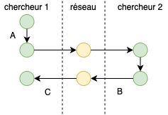
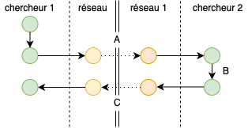
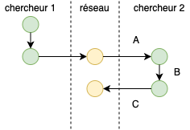

```{r setup, include=FALSE}
BioDataScience2::learnr_setup()
SciViews::R()
```

```{r, echo=FALSE}
BioDataScience2::learnr_banner()
```

```{r, context="server"}
BioDataScience2::learnr_server(input, output, session)
```

----

## Objectifs

- Réviser les notions du cours de Science des Données I.

## Logiciels 

Répondez aux questions ci-dessous.

```{r qu_intro}
quiz(
  question("Définissez 'SciViews Box'",
    answer("Une machine virtuelle dédiée à la recherche scientifique avec de nombreux programmes préconfigurés",
      correct = TRUE),
    answer("Un environnement de développement intégré"),
    answer("Un logiciel de gestion de versions"),
    answer("Un service web d'hébergement de projet"),
    answer("Un langage avec une syntaxe facile à lire et à écrire"),
    answer("Aucune des réponses proposées n'est correcte"),
    allow_retry = TRUE, random_answer_order = TRUE),
  question("Définissez 'RStudio'",
    answer("Une machine virtuelle dédiée à la recherche scientifique avec de nombreux programmes préconfigurés"),
    answer("Un environnement de développement intégré", correct = TRUE),
    answer("Un logiciel de gestion de versions"),
    answer("Un service web d'hébergement de projet"),
    answer("Un langage avec une syntaxe facile à lire et à écrire"),
    answer("Aucune des réponses proposées n'est correcte"),
    allow_retry = TRUE, random_answer_order = TRUE),
  question("Définissez 'Git'",
    answer("Une machine virtuelle dédiée à la recherche scientifique avec de nombreux programmes préconfigurés"),
    answer("Un environnement de développement intégré"),
    answer("Un logiciel de gestion de versions", correct = TRUE),
    answer("Un service web d'hébergement de projet"),
    answer("Un langage avec une syntaxe facile à lire et à écrire"),
    answer("Aucune des réponses proposées n'est correcte"),
    allow_retry = TRUE, random_answer_order = TRUE),
  question("Définissez 'GitHub'",
    answer("Une machine virtuelle dédiée à la recherche scientifique avec de nombreux programmes préconfigurés"),
    answer("Un environnement de développement intégré"),
    answer("Un logiciel de gestion de versions"),
    answer("Un service web d'hébergement de projet", correct = TRUE),
    answer("Un langage avec une syntaxe facile à lire et à écrire"),
    answer("Aucune des réponses proposées n'est correcte"),
    allow_retry = TRUE, random_answer_order = TRUE),
  question("Définissez 'Markdown'",
    answer("Une machine virtuelle dédiée à la recherche scientifique avec de nombreux programmes préconfigurés"),
    answer("Un environnement de développement intégré"),
    answer("Un logiciel de gestion de versions"),
    answer("Un service web d'hébergement de projet"),
    answer("Un langage avec une syntaxe facile à lire et à écrire", correct = TRUE),
    answer("Aucune des réponses proposées n'est correcte"),
    allow_retry = TRUE, random_answer_order = TRUE)
)
```

## Git et GitHub

Au cours de Science des Données, nous utilisons abondamment Git et GitHub. Assurez-vous d'avoir bien retenu la terminologie spécifique associée à ces outils de gestion de version.

### Situation 1

Deux chercheurs distants de plusieurs centaines de kilomètres, collaborent sur un projet commun. Ils ont pour cela décidé d'employer un outil de gestion de version et d'héberger ce projet sur un système web dédié pour cela. 

Sur base du schéma ci-dessous où chaque cercle de couleur correspond à un état du système de gestion de version de la situation expliquée, répondez aux questions suivantes.



```{r qu_git1}
quiz(
  question("Qualifiez l'action **A**",
    answer("commit", correct = TRUE),
    answer("clone"),
    answer("push"),
    answer("pull"),
    answer("fetch"),
    answer("fork"),
    answer("pull request"),
    allow_retry = TRUE, random_answer_order = TRUE),
  question("Qualifiez l'action **B**",
    answer("commit"),
    answer("clone"),
    answer("push", correct = TRUE),
    answer("pull"),
    answer("fetch"),
    answer("fork"),
    answer("pull request"),
    allow_retry = TRUE, random_answer_order = TRUE),
  question("Qualifiez l'action **C**",
    answer("commit"),
    answer("clone"),
    answer("push"),
    answer("pull", correct = TRUE),
    answer("fetch"),
    answer("fork"),
    answer("pull request"),
    allow_retry = TRUE, random_answer_order = TRUE)
)
```

### Situation 2

Le chercheur 2 s'intéresse au projet du chercheur 1, travaille dessus et propose des modifications afin de l'améliorer. Le schéma suivant représente l'évolution du système de gestion de version. Sur cette base, répondez aux questions suivantes.



```{r qu_git2}
quiz(
  question("Qualifiez l'action **A**",
    answer("commit"),
    answer("clone"),
    answer("push"),
    answer("pull"),
    answer("fetch"),
    answer("fork", correct = TRUE),
    answer("pull request"),
    allow_retry = TRUE, random_answer_order = TRUE),
  question("Qualifiez l'action **B**",
    answer("commit", correct = TRUE),
    answer("clone"),
    answer("push"),
    answer("pull"),
    answer("fetch"),
    answer("fork"),
    answer("pull request"),
    allow_retry = TRUE, random_answer_order = TRUE),
  question("Qualifiez l'action **C**",
    answer("commit"),
    answer("clone"),
    answer("push"),
    answer("pull"),
    answer("fetch"),
    answer("fork"),
    answer("pull request", correct = TRUE),
    allow_retry = TRUE, random_answer_order = TRUE)
)
```

### Situation 3

Le chercheur 2 vient d'intégrer le projet que le chercheur 1 réalisait seul. Il doit donc acquérir une copie du dépôt pour la première fois sur sa machine avant de pouvoir contribuer à ce projet. Sur base du schéma ci-dessous qui représente le travail des deux chercheurs, répondez aux questions suivantes.




```{r qu_git3}
quiz(
  question("Qualifiez l'action **A**",
    answer("commit"),
    answer("clone", correct = TRUE),
    answer("push"),
    answer("pull"),
    answer("fetch"),
    answer("fork"),
    answer("pull request"),
    allow_retry = TRUE, random_answer_order = TRUE),
  question("Qualifiez l'action **B**",
    answer("commit", correct = TRUE),
    answer("clone"),
    answer("push"),
    answer("pull"),
    answer("fetch"),
    answer("fork"),
    answer("pull request"),
    allow_retry = TRUE, random_answer_order = TRUE),
  question("Qualifiez l'action **C**",
    answer("commit"),
    answer("clone"),
    answer("push", correct = TRUE),
    answer("pull"),
    answer("fetch"),
    answer("fork"),
    answer("pull request"),
    allow_retry = TRUE, random_answer_order = TRUE)
)
```

## Biométrie d'oursins

Sur base des données qui sont mises à votre disposition, reproduisez le graphique ci-dessous\ : 

```{r}
urchin <- data.io::read("urchin_bio", package = "data.io", lang = "FR")

# Graphique à reproduire
chart(urchin, height ~ weight %col=% origin) +
  geom_point()
```

Le jeu des données mis à votre disposition est `urchin_bio` du package `data.io` qui comprend les variables suivantes\ : `r names(urchin)`.

```{r qu_np_h3, exercise=TRUE, exercise.lines=7}
# Importation des données 
urchin <- data.io::read(___, package = ___, lang = "FR")

# Votre graphique
chart(___, ___ ~ ___ %col=% ___) +
  geom_point()
```

```{r qu_np_h3-hint-1}
# Importation des données 
urchin <- data.io::read("urchin_bio", package = "data.io", lang = "FR")

# Votre graphique
chart(___, ___ ~ ___ %col=% ___) +
  geom_point()

# Relisez le chapitre 2 du livre Science des Données 1 <https://wp.sciviewg/sdd-umons/>
```

```{r qu_np_h3-hint-2}
# Importation des données 
urchin <- data.io::read("urchin_bio", package = "data.io", lang = "FR")

# Votre graphique
chart(urchin, ___ ~ ___ %col=% ___) +
  geom_point()

 #### ATTENTION: Hint suivant = solution !####
```

```{r qu_np_h3-solution}
## Solution ##
# Importation des données 
urchin <- data.io::read("urchin_bio", package = "data.io", lang = "FR")

# Votre graphique
chart(urchin, height ~ weight %col=% origin) +
  geom_point()
```

```{r qu_np_h3-check}
grade_code("Vous vous souvenez comment réaliser un nuage de points.")
```

## Croissance de dents

Sur base des données qui sont mises à votre disposition reproduisez le graphique ci-dessous à l'identique \ : 

```{r}
# Importation des données
tooth_growth <- read("ToothGrowth", package = "datasets") %>.%
  mutate(., dose = as.factor(dose))

tooth_growth <- labelise(
  tooth_growth,
  label = list(len = "Longueur des dents",
               supp = "Supplémentation",
               dose = "Dose"),
  units = list(len = "mm"))

# Graphique à reproduire
chart(data = tooth_growth, len ~ supp %fill=% dose) +
  geom_boxplot()
```

Le jeu des données mis à votre disposition est `ToothGrowth` du package `datasets` qui comprend les variables suivantes\ : `r names(ToothGrowth)`. 

```{r qu_bp_h5, exercise=TRUE, exercise.lines=15}
# Importation des données
tooth_growth <- read("ToothGrowth", package = "datasets") %>.%
  mutate(., dose = as.factor(dose))

# Vos labels
tooth_growth <- labelise(
  tooth_growth,
  label = list(len = ___,
               supp = ___,
               dose = "Dose"),
  units = list(len = "mm"))

# Votre graphique
chart(___, ___) +
  ___()
```

```{r qu_bp_h5-hint-1}
# Relisez le chapitre 2 du livre Science des Données 1 <https://wp.sciviewg/sdd-umons/>

# Importation des données
tooth_growth <- read("ToothGrowth", package = "datasets") %>.%
  mutate(., dose = as.factor(dose))

# Vos labels
tooth_growth <- labelise(
  tooth_growth,
  label = list(len = ___,
               supp = ___,
               dose = "Dose"),
  units = list(len = "mm"))

# Votre graphique
chart(___, ___) +
  ___()
```

```{r qu_bp_h5-hint-2}
# Importation des données
tooth_growth <- read("ToothGrowth", package = "datasets") %>.%
  mutate(., dose = as.factor(dose))

# Vos labels
tooth_growth <- labelise(
  tooth_growth,
  label = list(len = "Longueur des dents",
               supp = ___,
               dose = "Dose"),
  units = list(len = "mm"))

# Votre graphique
chart(___, ___ ~ ___) +
  ___()
```

```{r qu_bp_h5-hint-3}
# Importation des données
tooth_growth <- read("ToothGrowth", package = "datasets") %>.%
  mutate(., dose = as.factor(dose))

# Vos labels
tooth_growth <- labelise(
  tooth_growth,
  label = list(len = "Longueur des dents",
               supp = ___,
               dose = "Dose"),
  units = list(len = "mm"))

# Votre graphique
chart(data = tooth_growth, ___ ~ ___ %fill=% ___) +
  geom_boxplot()
```

```{r qu_bp_h5-hint-4}
# Importation des données
tooth_growth <- read("ToothGrowth", package = "datasets") %>.%
  mutate(., dose = as.factor(dose))

# Vos labels 
tooth_growth <- labelise(
  tooth_growth,
  label = list(len = "Longueur des dents",
               supp = "Supplémentation",
               dose = "Dose"),
  units = list(len = "mm"))

# Votre graphique
chart(data = tooth_growth, len ~ supp %fill=% ___) +
  geom_boxplot()

 #### ATTENTION: Hint suivant = solution !####
```

```{r qu_bp_h5-solution}
## Solution ##
# Importation des données
tooth_growth <- read("ToothGrowth", package = "datasets") %>.%
  mutate(., dose = as.factor(dose))

# Vos labels 
tooth_growth <- labelise(
  tooth_growth,
  label = list(len = "Longueur des dents",
               supp = "Supplémentation",
               dose = "Dose"),
  units = list(len = "mm"))

# Votre graphique
chart(data = tooth_growth, len ~ supp %fill=% dose) +
  geom_boxplot()
```

```{r qu_bp_h5-check}
grade_code("Vous vous souvenez comment réaliser une boite de dispersion.")
```


## Biométrie humaine 1

Sur base de données relatives à de la biométrie humaine, reproduisez le graphique ci-dessous\ : 

```{r, warning=FALSE}
# Importation des données
biometry <- read("biometry", package = "BioDataScience", lang = "FR")

# Graphique à reproduire 
chart(biometry, ~ weight | gender) + 
  geom_histogram() +
  ylab("Dénombrement")
```

Le jeu des données mis à votre disposition est `biometry` du package `BioDataScience` qui comprend les variables suivantes\ : `r names(biometry)`.

```{r qu_facette_h4, exercise=TRUE, exercise.lines=8}
# Importation des données
biometry <- read("biometry", package = "BioDataScience", lang = "FR")

# Votre graphique 
chart(___, ___) +
  ___() +
  ylab(___)
```

```{r qu_facette_h4-hint-1}
# Relisez le chapitre 3 du livre Science des Données 1 <https://wp.sciviewg/sdd-umons/>

# Importation des données
biometry <- read("biometry", package = "BioDataScience", lang = "FR")

# Votre graphique 
chart(___, ___) +
  ___() +
  ylab(___)
```

```{r qu_facette_h4-hint-2}
# Importation des données
biometry <- read("biometry", package = "BioDataScience", lang = "FR")

# Votre graphique 
chart(biometry, ~ ___) +
  geom_histogram() +
  ylab(___)
```

```{r qu_facette_h4-hint-3}
# Importation des données
biometry <- read("biometry", package = "BioDataScience", lang = "FR")

# Votre graphique 
chart(biometry, ~ ___ | ___) +
  geom_histogram() +
  ylab(___)

#### ATTENTION: Hint suivant = solution !####
```

```{r qu_facette_h4-solution}
## Solution ##
# Importation des données
biometry <- read("biometry", package = "BioDataScience", lang = "FR")

# Votre graphique 
chart(biometry, ~ weight | gender) + 
  geom_histogram() +
  ylab("Dénombrement")
```

```{r qu_facette_h4-check}
grade_code("Vous vous souvenez de la façon d'utiliser les facettes dans un graphique.")
```

## Biométrie humaine 2

Calculer l'indice de masse corporelle imc (variable `bmi` en anglais) qui correspond à la formule suivante\ :

$$bmi = mass\ [kg]/height [m]^2$$
Vous travaillez toujours sur le jeu des données `biometry` du package `BioDataScience` qui comprend, pour rappel, les variables suivantes\ : `r names(biometry)`.

```{r qu_mutate_h2, exercise=TRUE, exercise.lines=10}
# Importation des données
biometry <- read("biometry", package = "BioDataScience", lang = "FR")
# Calcul du bmi
biometry <- mutate(___,
  height_m = ___/100, 
  bmi = ___/___^2)
# résumé de jeu de données
summary(biometry)
```

```{r qu_mutate_h2-hint-1}
# Importation des données
biometry <- read("biometry", package = "BioDataScience", lang = "FR")
# Calcul du bmi
biometry <- mutate(biometry,
  height_m = ___/100, 
  bmi = ___/height_m^2)
# résumé de jeu de données
summary(biometry)

#### ATTENTION: Hint suivant = solution !####
```

```{r qu_mutate_h2-solution}
# Importation des données
biometry <- read("biometry", package = "BioDataScience", lang = "FR")
# Calcul du bmi
biometry <- mutate(biometry,
  height_m = height/100, 
  bmi = weight/height_m^2)
# résumé de jeu de données
summary(biometry)
```

```{r qu_mutate_h2-check}
grade_code("Vous êtes toujours capable d'utiliser la fonction mutate().")
```

## Rendement de patates

Des scientifiques belges s'intéressent aux rendements de deux variétés de pomme de terre\ : la bintje et la fontane. Après 110 jours, ils réalisent des prélèvements sur différentes parcelles en Belgique dont ils quantifient la production, exprimée en tonnes par hectare. 

```{r, warning=FALSE, message=FALSE}
set.seed(42)
pdt <- tibble(
  rendement = c(
    rnorm(n = 18, mean = 33.6, sd = 4),
    rnorm(n = 28, mean = 39.5, sd = 4)), 
  variete = c(
    rep("bintje", times = 18),
    rep("fontane", times = 28))
)
```

Reproduisez le tableau ci-dessous, le jeu de données mis à votre disposition se nomme `pdt` et les variables sont les suivantes\ : `r names(pdt)`. La fonction de mise en forme du tableau est `kable()` du package `knitr`.

```{r}
pdt %>.%
  group_by(., variete) %>.%
  summarise(., mean = mean(rendement), count = n()) %>.%
  knitr::kable(., col.names =
    c("Variété" ,"Rendement moyen [t/ha]", "Nombre de parcelles"))
```

```{r qu_group-prep}
set.seed(42)
pdt <- tibble(
  rendement = c(
    rnorm(n = 18, mean = 33.6, sd = 4),
    rnorm(n = 28, mean = 39.5, sd = 4)), 
  variete = c(
    rep("bintje", times = 18),
    rep("fontane", times = 28))
)
```

```{r qu_group_h3, exercise=TRUE, exercise.lines=5, exercise.setup="qu_group-prep"}
pdt %>.%
  group_by(., ___) %>.%
  summarise(., mean = ___(___), count = ___()) %>.%
  knitr::kable(., ___)
```

```{r qu_group_h3-hint-1}
pdt %>.%
  group_by(., ) %>.%
  summarise(., mean = ___(___), count = ___()) %>.%
  knitr::kable(., col.names = c(___,___,___))
```

```{r qu_group_h3-hint-2}
pdt %>.%
  group_by(., ) %>.%
  summarise(., mean = mean(rendement), count = n()) %>.%
  knitr::kable(., col.names = c(___,___,___))

#### ATTENTION: Hint suivant = solution !####
```

```{r qu_group_h3-solution}
pdt %>.%
  group_by(., variete) %>.%
  summarise(., mean = mean(rendement), count = n()) %>.%
  knitr::kable(., col.names = c("Variété" ,"Rendement moyen [t/ha]", "Nombre de parcelles"))
```

```{r qu_group_h3-check}
grade_code("Vous savez uiliser correctement les fonctions de résumé de tableau dans R.")
```

Cet exercice s'inspire des observations relayé sur le site du sillon Belge de d'un [article consulté le 3 septembre 2019](https://www.sillonbelge.be/4731/article/2019-08-28/bintje-et-fontane-apres-110-115-jours-faute-de-casser-la-baraque-ces-deux).

## Taureaux d'élevage

```{r, warning=FALSE, message=FALSE, results='hide'}
beef <- data.io::read(file = system.file("extdata", "belgianblue.xlsx",
  package = "BioDataScience2"), type = "xlsx")

beef <- labelise(
  beef,
  label = list(weight = "Masse", age = "Age", variety = "Variété"),
  unit = list(weight = "kg", age = "mois"))
```

L'association wallonne de l'élevage dispose de plusieurs centres d'insémination. Ils ont un recensement des différents taureaux reproducteurs. Réalisez par vous-même le graphique ci-dessous. Notez bien que ce dernier ne montre que les individus âgés de 20 à 55 mois. Vous avez à votre disposition le jeu de données `beef` qui comprend les variables suivantes\ : `r names(beef)`.

```{r}
beef %>.%
  filter(., age >= 20 & age <= 55) %>.%
  chart(., weight ~ age %col=% variety) +
  geom_point()
```

Voici quelques informations utiles sur ce jeu de données.

```{r, echo=TRUE}
summary(beef)
```

```{r, qu_filter_h4-prep}
beef <- read(file = system.file("extdata", "belgianblue.xlsx",
  package = "BioDataScience2"), type = "xlsx")

beef <- labelise(
  beef,
  label = list(weight = "Masse", age = "Age", variety = "Variété"),
  unit = list(weight = "kg", age = "mois"))
```

```{r qu_filter_h4, exercise=TRUE, exercise.lines=8, exercise.setup="qu_filter_h4-prep"}
# Le jeu de données beef est déjà chargé en mémoire
# Réalisez votre graphique
beef %>.%
  ___(., ___ & ___) %>.%
  chart(., ___) +
  ___()
```

```{r qu_filter_h4-hint-1}
# Le jeu de données beef est déjà chargé en mémoire
# Réalisez votre graphique
beef %>.%
  filter(., ___ & ___) %>.%
  chart(., ___) +
  ___() 

# La fonction pour filtrer des lignes d'un tableau selon une ou plusieurs conditions est filter()
```

```{r qu_filter_h4-hint-2}
# Le jeu de données beef est déjà chargé en mémoire
# Réalisez votre graphique
beef %>.%
  filter(., ___ & ___) %>.%
  chart(., ___) +
  ___() 

# Les conditions au sein de la fonction filter() s'écrivent avec des opérateurs logique >, >=, <=, <, == ou !=
# et se combinent avec & (et) et | (ou)
```

```{r qu_filter_h4-hint-3}
# Le jeu de données beef est déjà chargé en mémoire
# Réalisez votre graphique
beef %>.%
  filter(., age >= 20 & age <= 55) %>.%
  chart(., ___) +
  ___()

 #### ATTENTION: Hint suivant = solution !####
```

```{r qu_filter_h4-solution}
## Solution ##
# Le jeu de données beef est déjà chargé en mémoire
# Réalisez votre graphique
beef %>.%
  filter(., age >= 20 & age <= 55) %>.%
  chart(., weight ~ age %col=% variety) +
  geom_point()
```

```{r qu_filter_h4-check}
grade_code("Vous vous souvenez de l'utilisation des filtres sur les tableaux.")
```

## Test de Student

```{r}
set.seed(43)
weight <- tibble::tibble(
  weight = c(
    rnorm(n = 15, mean = 100, sd = 5), 
    rnorm(n = 15, mean = 102, sd = 5)), 
  area = rep(c("a", "b"), each = 15)
)
weight$area <- as.factor(weight$area)
```

Vous avez à votre disposition le jeu de données `weight` dont voici quelques informations\ :

```{r, echo=TRUE}
# Nom des variables du jeu de données
names(weight)
# Résumé des variables
summary(weight)
```

Réalisez un test de Student bilatéral avec un seuil $\alpha$ de 0.05 et de variances inégales.

```{r qu_student_prepa}
set.seed(43)
weight <- tibble::tibble(
  weight = c(
    rnorm(n = 15, mean = 100, sd = 5), 
    rnorm(n = 15, mean = 102, sd = 5)), 
  area = rep(c("a", "b"), each = 15)
)
weight$area <- as.factor(weight$area)
```

```{r qu_student_h3, exercise=TRUE, exercise.lines=3, exercise.setup="qu_student_prepa"}
t.test(data = ___, ___ ~ ___,
  alternative = ___, conf.level = ___, var.equal = ___)
```

```{r qu_student_h3-hint-1}
t.test(data = ___, ___ ~ ___,
  alternative = "two.sided", conf.level = 0.95, var.equal = ___)
```

```{r qu_student_h3-hint-2}
t.test(data = ___, ___ ~ ___,
  alternative = "two.sided", conf.level = 0.95, var.equal = FALSE)

 #### ATTENTION: Hint suivant = solution !####
```

```{r qu_student_h3-solution}
##Solutions##
t.test(data = weight, weight ~ area,
  alternative = "two.sided", conf.level = 0.95, var.equal = FALSE)
```

```{r qu_student_h3-check}
grade_code("Vous vous souvenez de l'utilisation du test de Student.")
```

```{r qu_student1}
question("Y a t'il une différence significative au seuil $\\alpha$ de 0.05 de masse entre les deux zones étudiées pour la masse ?",
  answer("oui"),
  answer("non", correct = TRUE), 
  random_answer_order = TRUE, allow_retry = TRUE)
```

## Choix d'un test statistique

```{r qu_test}
question("Indiquez quel test statistique permet de vérifier l'homogénéité des variances",
  answer("Test de Bartlett", correct = TRUE),
  answer("Test de Shapiro-Wilk"),
  answer("Test de Friedman"),
  answer("Test de Pearson"),
  answer("Aucune des réponses proposées"),
  random_answer_order = TRUE, allow_retry = TRUE)
```

## Conclusion

Vous venez de terminer votre séance d'exercices de révision.

```{r comm_noscore, echo=FALSE}
question_text("Laissez-nous vos impressions sur ce learnr",
  answer("", TRUE, message = "Pas de commentaires... C'est bien aussi."),
  incorrect = "Vos commentaires sont enregistrés.",
  placeholder = "Entrez vos commentaires ici...",
  allow_retry = TRUE
)
```
