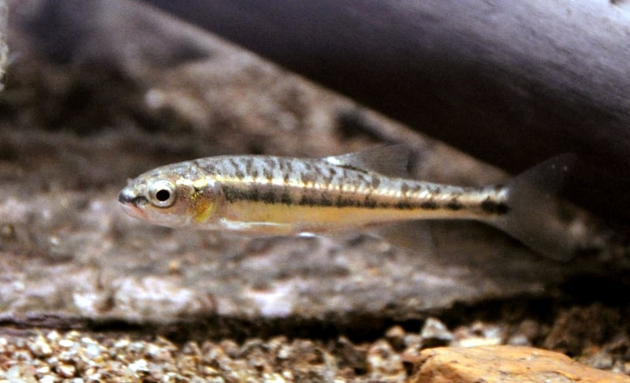

```{r setup, include=FALSE}
BioDataScience2::learnr_setup()
SciViews::R("explore")

# A hack to get fun$type() working in learnr
#chart <- list(
#  vertical = function(data, type, ...) chart(data, type = "vertical", ...),
#  horizontal = function(data, type, ...) chart(data, type = "horizontal", ...),
#  circular = function(data, type, ...) chart(data, type = "circular", ...)
#)

# Loading datasets
data("doubs", package = "ade4")
envir <- as_dtx(doubs$env)
fish <- as_dtx(doubs$fish)
```

```{r, echo=FALSE}
BioDataScience2::learnr_banner()
```

```{r, context="server"}
BioDataScience2::learnr_server(input, output, session)
```

------------------------------------------------------------------------

## Objectifs

-   Vérifier que vous avez bien compris la logique et les différentes étapes de réalisation d'un dendrogramme : matrice de distance, classification ascendante hiérarchique (CAH), représentation graphique et coupure du dendrogramme pour obtenir des groupes.
-   Vous préparer à analyser et interpréter de manière autonome un jeu de données multivariées à l'aide de la CAH.

Vous devez avoir étudié le contenu du [module 6](https://wp.sciviews.org/sdd-umons2/?iframe=wp.sciviews.org/sdd-umons2-2022/cah-kmeans-div.html){target="_blank"} du cours et réalisé les exercices H5P qui s'y trouvent avant de vous lancer dans ce tutoriel Learnr.

## Communautés piscicoles de rivière


Le [Doubs](http://www.cosmovisions.com/Doubs.htm){target="_blank"} (prononcez "dou") est une rivière qui serpente entre la France et la Suisse pour se jeter finalement dans la Saône près de Chalon-sur-Saône (point noir sur la carte ci-dessous) après avoir parcouru près de 450 km.


La distribution des poissons est étudiée dans cette rivière (Verneaux 1973). Pour ce faire, 30 stations sont échantillonnées tout au long de son cours. Le schéma suivant montre la disposition relative des stations les unes par rapport aux autres depuis la source (station1) jusqu'à ce que la rivière se déverse dans la Saône (après la station 30).

```{r, echo=FALSE}
doubs$xy %>.%
  smutate(., station = 1:30) %>.%
  chart(., y ~ x %label=% station) +
    geom_path() +
    geom_point() +
    ggrepel::geom_label_repel() +
    theme_void()
```

À chaque station, les hommes de terrain ont effectué une collecte des poissons présents et les ont dénombrés. Au total, ils ont observé 27 espèces reprises dans la table suivante.

```{r, echo=FALSE}
doubs$species %>.%
  sselect(., -English) %>.%
  smutate(., Scientific = paste0("*", Scientific, "*")) %>.%
  srename(., `Nom scientifique` = Scientific, `Nom français` = French,
    Code = code) %>.%
  knitr::kable(.)
```



Le tableau de données, dans `fish` se présente comme ceci (seules les 6 premières lignes sont imprimées) :

```{r, echo=TRUE}
head(fish)
```

Vous vous doutez bien que plusieurs micro-habitats différents doivent exister tout au long de la rivière. Par ailleurs, une variation progressive d'une station à l'autre est également possible ici. Votre objectif est de caractériser ces micro-habitats sur base de la composition piscicole. Il s'agit d'un problème de regroupement à partir de données multivariées et la CAH est toute indiquée ici.

**Référence**

Verneaux, J. (1973) Cours d'eau de Franche-Comté (Massif du Jura). Recherches écologiques sur le réseau hydrographique du Doubs. Essai de biotypologie. Thèse d'état, Besançon. 1--257.

## Étape 1 : transformation des données

Comme à notre habitude, nous commençons par décrire nos données. La fonction `skimr::skim()` donne une bonne idée de la répartition des données. La zone de code R ci-dessous est à votre disposition pour expérimenter autre chose si vous le souhaitez.

```{r explore_fish_noscore, exercise=TRUE}
# Utilisez librement cette zone pour explorer `fish` (optionnel)

```

```{r, echo=TRUE}
skimr::skim(fish)
```

Nous n'avons pas de valeurs manquantes et les valeurs sont toutes bornées entre 0 et 5. Il s'agit en fait de **classes d'abondance**, avec 0 = absence et 5 = abondance maximale, voir [ce descriptif complet](http://pbil.univ-lyon1.fr/R/pdf/pps047.pdf){target="_blank"}. Nous voyons sur les mini-barplots dans le tableau que la valeur zéro domine, et c'est aussi la médiane (`p50`) pour bon nombre d'espèces, indiquant ainsi qu'elles sont absentes dans plus de la moitié des stations. Par contre, la valeur maximale (`P100`) est pratiquement toujours 5. Puisque les classes d'abondance ont été définies par rapport à l'abondance maximale de chaque espèce dans le jeu de données, ce n'est pas surprenant. Nous n'avons pas 5 partout car le jeu de données initial reprend aussi les effluents de la Doubs, donc plus du double de stations, non reprises ici.

```{r qu_transfo_fish}
question("À partir des données du tableau et de la description ci-dessus, quelles transformations ou remaniements des données seraient judiceuses ici ? (plusieurs réponses peuvent être sélectionnées)",
  answer("Aucune", correct = TRUE),
  answer("Élimination des espèces très rares", correct = TRUE),
  answer("Logarithme", message = "La transformation logarithmique est utilisée lorsqu'il y a une très large plage dans les données (plusieurs ordres de grandeurs) et pas de valeurs nulles ou négatives."),
  answer("Logarithme(x + 1)", message = "log(x + 1) est utilisé pour réduire une disparité de plusieurs ordres des grandeur et lorsque les valeurs sont nulles ou positives."),
  answer("Double racine carrée", message = "La transformation double racine carrée est utilisée pour minimiser de manière douce l'impact des espèces abondantes lorsque les données sont des dénombrements non encore transformés."),
  answer("Exponentielle", message = "La transformation exponentielle amplifie la différence entre espèces abondantes et rares ; elle donne un poids encore plus grands aux plus abondants."),
  allow_retry = TRUE, random_answer_order = TRUE,
  incorrect = "Réfléchissez... est-ce ici des données brutes, ou alors sont-elles déjà transformées ? Que faut-il faire avec les espèces rares ?",
  correct = "Bravo ! Ici les classes d'abondance de 0 à 5 sont parfaites. La question subsiste quant à garder ou non les espèces qui ne seraient observées que très, très rarement... mais comme nous n'avons pas à disposition les dénombrements bruts, nous ne pourrons pas le faire. Nous faisons donc confiance au prétraitement réalisé par les auteurs initiaux.")
```

## Étape 2 : matrice de distances

Nous réalisons ensuite une matrice des distances entre stations. Des dizaines d'indices différents existent. Lequel ou lesquelles choisiriez-vous ici, si nous nous cantonnons aux quatre indices principaux détaillés dans le cours (pour une présentation vraiment beaucoup plus complète des indices, voyez [cet article](http://www.numericalecology.com/Reprints/Gower&Leg_JClass86.pdf){target="_blank"}, un des grands spécialistes de ce domaine) ?

```{r qu_indice_fish}
question("À partir des données du tableau `fish`, vous souhaitez réaliser un matrice de distances avec l'indice le plus adapté. Quel indice pourriez-vous choisir ? (plusieurs réponses peuvent être sélectionnées)",
  answer("Indice de Bray-Curtis", correct = TRUE),
  answer("Indice de Canberra", correct = TRUE),
  answer("Distance Euclidienne"),
  answer("Indice de Manhattan"), 
  allow_retry = TRUE, random_answer_order = TRUE,
  incorrect = "La grande question à se poser est celle de la représentativité des doubles zéros (et nous avons vu qu'il y en a beaucoup dans notre jeu de données.",
  correct = "Seuls les indices qui n'utilisent pas les doubles zéros comme information sont pertinents ici. Canberra effectuera une pondération des espèces les unes par rapport aux autres contrairement à Bray-Curtis. Cela correspond à deux points de vue différents : soit la communauté dans son ensemble caractérise le milieu, soit les espèces les plus abondantes définissent principalement ces communautés. En pratique ici, la pondération est déjà incluse via l'échelle d'abondance par espèce.")
```

### Calcul de la matrice de distances

A partir du jeu de données `fish`, calculez la matrice de distances entre stations en utilisant l'indice de Bray-Curtis et `dissimilarity()`, considérant que toutes les fonctions nécessaires sont déjà chargées dans R. Pour une aide concernant les arguments de la fonction, voyez `?vegan::vegdist`.

```{r fish_bray_h2, exercise=TRUE}
print(fish_dist <- ___(___, ___ = ___))
```

```{r fish_bray_h2-hint-1}
print(fish_dist <- dissimilarity(___, method = "___"))

#### ATTENTION: Hint suivant = solution !####
```

```{r fish_bray_h2-solution}
## Solution ##
print(fish_dist <- dissimilarity(fish, method = "bray"))
```

```{r fish_bray_h2-check}
grade_code("Vous venez de réaliser votre première matrice de distances. L'argument `method =` de la fonction `dissimilarity()` précise la métrique utilisée : \"bray\" pour Bray-Curtis, \"canberra\" pour l'indice de Canberra, \"euclidean\" pour la distance Euclidienne et \"manhattan\" pour la distance de Manhattan, ...")
```

Notez l'avis (warning) qui s'affiche. En réalité, aucun poisson n'a été observé à la station 8. Dans ce cas, la métrique n'est pas fiable pour la comparaison (ne pas en observer ne signifie pas qu'il n'y en a pas, mais juste qu'on n'en a pas capturé).

En temps normal, nous pourrions aussi tester d'autres variantes en utilisant, par exemple, l'indice de Canberra ou en transformant les données. Mais ici, l'échelle choisie a *déjà* réglé le problème des espèces abondantes *versus* rares en faveur d'un poids équivalent pour chaque espèce.

Si nous avions voulu comparer les espèces (colonnes) plutôt que les stations (lignes), nous aurions dû transposer le tableau avec l'argument `transpose = TRUE` de `dissimilarity()`.

## Données environnementales

En plus des données sur l'abondance de 27 espèces de poissons, les chercheurs ont mesuré onze variables environnementales en chacune des 30 stations. Avoir des données quantifiées sur l'habitat est évidemment indispensable pour pouvoir comprendre et expliquer la distribution de nos poissons dans la rivière. Ces données environnementales peuvent également servir à classer les micro-habitats selon un critère différents. Nous utiliserons encore une fois la CAH ici pour ce faire. Voici le détail des onze variables mesurées. Notez que les auteurs ont décidé d'appliquer des coefficients multiplicateurs ici pour homogénéiser les données :

|  label  | description                      | unités \* coef |
|:-------:|:---------------------------------|:---------------|
| **dfs** | distance depuis la source        | km \* 10       |
| **alt** | altitude                         | m              |
| **slo** | pente des berges en `log(x + 1)` | ‰ \* 100       |
| **flo** | flux moyen minimum               | m^3^/s \* 100  |
| **pH**  | pH de l'eau                      | \- \* 10       |
| **har** | dureté totale de l'eau           | mg Ca^++^/L    |
| **pho** | phosphates                       | mg/L \* 100    |
| **nit** | nitrates                         | mg/L \* 100    |
| **amm** | azote ammoniacal                 | mg/L \* 100    |
| **oxy** | oxygène dissout                  | mg/L \* 10     |
| **bdo** | demande biologique en oxygène    | mg/L \* 10     |

Voici les premières lignes du tableau `envir` qui contient ces données.

```{r}
head(envir)
```

Nos commençons par décrire ces données. Nous nous limitons ici à utiliser `skimr::skim()` pour avoir une idée globale, mais vous pouvez aussi expérimenter d'autres choses dans la zone de code R libre ci-dessous.

```{r explore_envir_noscore, exercise=TRUE}
# Utilisez librement cette zone pour explorer `envir` (optionnel)

```

```{r}
skimr::skim(envir)
```

Il n'y a aucune donnée manquante. Toutes les variables sont numériques continues. Les unités sont différentes, mais les auteurs ont pris soin de les multiplier par des puissances de 10 sans doute pour limiter les différences trop importantes d'échelles entre elles. Aucune donnée n'est négative, mais il y a des valeurs nulles pour l'ammonium (`p0` et `p25`). La première question à nous poser est : un remaniement ou une transformation de ces données sont-ils nécessaire ?

```{r qu_transfo_envir}
question("À partir des données du tableau et de la description ci-dessus, quelles transformations ou remainement des données seraient judiceuses ici ? (plusieurs réponses peuvent être sélectionnées)",
  answer("Aucune", correct = TRUE),
  answer("Standardisation", correct = TRUE),
  answer("Logarithme", message = "La transformation logarithmique est utilisée lorsqu'il y a une très large plage dans les données (plusieurs ordres de grandeur) et pas de valeurs nulles ou négatives"),
  answer("Logarithme(x + 1)", message = "log(x + 1) est utilisé pour réduire une disparité de plusieurs ordres des grandeur et lorsque les valeurs sont nulles ou positives"),
  answer("Double racine carrée", message = "La transformation double racine carrée est utilisée pour minimiser de manière douce l'impact des espèces abondantes lorsque les données sont des dénombrements non encore transformés"),
  answer("Exponentielle", message = "L'exponentielle amplifie la différence entre les petites et les grandes valeurs ; elle donne un poids encore plus grands aux observations élevées"),
  allow_retry = TRUE, random_answer_order = TRUE,
  incorrect = "Réfléchissez... est-ce ici des données brutes, ou alors sont-elles déjà transformées ?",
  correct = "Ici une mise à l'échelle partielle a déjà été réalisée via les coefficients multiplicateurs (et la transformée log(x + 1) pour la pente). Aucune transformation supplémentaire n'est donc requise. Sinon, nous pouvons toujours standardiser les données, et cela se justifie lorsque nous avons des unités différents et incompatibles entre elles comme ici.")
```

### Choix de l'indice

```{r qu_indice_envir}
question("Vous souhaitez réaliser un matrice de distances sur les données environnementales. Quels sont les indices les plus adaptés ?",
  answer("Indice de Bray-Curtis", message = "L'indice de Bray-Curtis sert plutôt pour des dénombrements d'espèces."),
  answer("Indice de Canberra", message = "L'indice de Canberra ne prenant pas en compte les doubles zéros, il est plutôt mal adapté pour des données environnementales."),
  answer("Distance Euclidienne", correct = TRUE),
  answer("Indice de Manhattan", correct = TRUE), 
  allow_retry = TRUE, random_answer_order = TRUE,
  incorrect = "Hum, pas tout-à-fait... Quelles métriques prennent en compte les doubles zéros comme similarité (deux sites ayant même concentration nulle en une substance chimique se ressemblent).",
  correct = "Excellent ! C'est en fait des métriques différentes qui sont utilisées pour les dénombrement d'espèces ou les données environnementales.")
```

### Distance Euclidienne 1

A partir des données contenues dans `envir`, calculez la matrice de dissimilarités en utilisant la distance Euclidienne et *sans* transformer les données. Pour rappel, vous explorez l'aide en ligne de `?vegan::vegdist` pour déterminer les arguments à utiliser dans `dissimilarity()`.

```{r euclidean1_h2, exercise=TRUE}
print(envir_dist <- ___(___, ___))
```

```{r euclidean1_h2-hint-1}
print(envir_dist <- ___(___, method = "___"))

#### ATTENTION: Hint suivant = solution !####
```

```{r euclidean1_h2-solution}
## Solution ##
print(envir_dist <- dissimilarity(envir, method = "euclidean"))
```

```{r euclidean1_h2-check}
grade_code("Parfait ! Nous allons calculer une autre version de la matrice de dissimilarité pour comparaison.")
```

### Distance Euclidienne 2

Calculez une nouvelle matrice de dissimilarités de distances euclidiennes, mais cette fois en **standardisant** les données. Inspirez-vous des notes de cours pour déterminer quel argument utiliser en plus pour cela.

```{r euclidean2_h3, exercise=TRUE}
print(envir_dist <- ___(___, ___, ___))
```

```{r euclidean2_h3-hint-1}
print(envir_dist <- dissimilarity(___, method = "___", ___))
```

```{r euclidean2_h3-hint-2}
print(envir_dist <- dissimilarity(___, method = "euclidean", ___ = TRUE))

#### ATTENTION: Hint suivant = solution !####
```

```{r euclidean2_h3-solution}
## Solution ##
print(envir_dist <- dissimilarity(envir, method = "euclidean", scale = TRUE))
```

```{r euclidean2_h3-check}
grade_code("Amazing whaaa ! Vous pourriez aussi essayer une autre méthode sur ces données standardisées comme la distance de Manhattan en utilisant `method = \"manhattan\"`. La fonction qui standardise en R est scale(), et l'argument ici porte le même nom : scale = ")
```

## Étape 3 : classification ascendante hiérarchique

Maintenant que vous pouvez calculer vos matrices de distances, passez à l'étape suivante et réalisez une classification hiérarchique ascendante, et puis un dendrogramme.

```{r hac_prep}
envir_dist <- dissimilarity(envir, method = "euclidean", scale = TRUE)
```

### Dendrogramme 1

Commencez par calculer le dendgrogramme à l'aide de `cluster()` et de la matrice de dissimilarité `envir_dist` que vous avez à disposition et qui correspond à la matrice standardisée calculée dans l'exercice précédant. Utilisez ensuite `chart()` pour afficher ce dendrogramme.

```{r hclust1_h2, exercise=TRUE, exercise.setup="hac_prep"}
envir_clust <- ___(___)
___(___)
```

```{r hclust1_h2-hint-1}
envir_clust <- cluster(___)
chart(___)

#### ATTENTION: Hint suivant = solution !####
```

```{r hclust1_h2-solution}
## Solution ##
envir_clust <- cluster(envir_dist)
chart(envir_clust)
```

```{r hclust1_h2-check}
grade_code("Félicitation ! Vous venez de réaliser votre premier dendrogramme. Savez-vous qu'il existe plusieurs stratégies possibles pour comparer les distances ? Utiliser l'argument `method =` de la fonction `cluster()` pour changer de méthode. Par défaut, c'est la méthode des liens complets qui est utilisée `method = \"complete\"`.")
```

### Dendrogramme 2

Réalisez un nouveau dendrogramme à partir de l'objet `envir_dist` mais cette fois-ci, utilisez la **méthode de Ward D2**. Voyez l'aide en ligne de la fonction `?stats::hclust` pour le détails des arguments à employer. Tracez ensuite votre dendrogramme de manière **circulaire** (utilisez la même logique que pour obtenir un dendrogramme horizontal).

```{r hclust2_h3, exercise=TRUE, exercise.setup="hac_prep"}
envir_clust <- ___(___, ___)
___$___(___)
```

```{r hclust2_h3-hint-1}
envir_clust <- hclust(___, method = "___")
chart$___(___)
```

```{r hclust2_h3-hint-2}
envir_clust <- hclust(___, method = ___)
chart$circular(___)

#### ATTENTION: Hint suivant = solution !####
```

```{r hclust2_h3-solution}
## Solution ##
envir_clust <- cluster(envir_dist, method = "ward.D2")
chart$circular(envir_clust)
```

```{r hclust2_h3-check}
grade_code("Très bien ! Regardez comme cette technique vous a permis d'obtenir des groupes bien individualisés. Il existe bien d'autres méthodes que vous pouvez utiliser pour calculer votre dendrogramme. Un dendrogramme circulaire permet de l'étaler beaucoup plus. C'est utile lorsqu'il y a beaucoup d'individus à représenter. Par contre, il est moins facile à lire.")
```

La variante horizontale du dendrogramme permet aussi de visionner plus d'items que le dendrogramme vertical sans qu'il ne soit trop encombré. Contrairement à la version circulaire, il est beaucoup plus facile d'y repérer le niveau de coupure idéal.

### Dendrogramme 3

```{r group_prep}
envir_dist <- dissimilarity(envir, method = "euclidean", scale = TRUE)
envir_clust <- cluster(envir_dist, method = "ward.D2")
```

En partant de `envir_clust` calculé par la méthode Ward D2 ci-dessus qui est déjà en mémoire, tracez maintenant un dendrogramme **horizontal**, et indiquez-y un **niveau de coupure à hauteur de 7 en rouge** (inspirez-vous des notes du cours pour voir quel `geom_...()` utiliser).

```{r hclust3_h2, exercise=TRUE, exercise.setup="group_prep"}
chart$___(___) +
  ___(___)
```

```{r hclust3_h2-hint}
chart$___(___) +
  geom_dendroline(___ = 7, ___ = "red")

#### ATTENTION: Hint suivant = solution !####
```

```{r hclust3_h2-solution}
## Solution ##
chart$horizontal(envir_clust) +
  geom_dendroline(h = 7, color = "red")
```

```{r hclust3_h2-check}
grade_code("Bravo. Vous voyez en quoi ce dendrogramme est plus facile à utiliser pour déterminer un niveau de coupure idéale ? Une coupure à 7 permet de former 4 groupes. Une coupure à 10 se justifie également, et elle séparera alors les stations en 3 groupes.")
```

Notez que vous indiquez le niveau de coupure avec le même code, quelle que soit la variante du dendrogramme utilisée avec `chart()`. Il n'est pas toujours facile de repérer la valeur à utiliser pour la coupure. La méthode `str()` appliquée à votre objet "cluster" `envir_clust` vous renvoie une visualisation textuelle du dendrogramme qui permet de lire directement les niveaux des différentes branches. Pour ne pas afficher tout, mais limiter à un nombre de groupes donnés, vous pouvez utiliser l'argument `max.level = <nbr_de_groupes>`. Démonstration.

```{r}
envir_dist <- dissimilarity(envir, method = "euclidean", scale = TRUE)
envir_clust <- cluster(envir_dist, method = "ward.D2")
```

```{r, echo=TRUE}
str(envir_clust, max.level = 5)
```

## Interprétation

Une fois le dendrogramme réalisé et le niveau de coupure choisi, nous devons récupérer les groupes ainsi constitués afin de les interpréter. Vous utilisez `predict()` pour récupérer un vecteur nommé (nom des stations de 1 à 30 au dessus, groupes de 1 à 4 en dessous) :

```{r}
# We need to repeat this because the preparation to the exercice is erased once
# the exercise is done!
envir_dist <- dissimilarity(envir, method = "euclidean", scale = TRUE)
envir_clust <- cluster(envir_dist, method = "ward.D2")
```

```{r, echo=TRUE}
(envir_groups <- predict(envir_clust, h = 7))
```

Un premier critère pour déterminer si notre regroupement à un sens ici est de repérer une continuité dans les groupes (des stations proches les unes des autres sont-elles regroupées ?) En effet, cette information de contiguïté spatiale n'a **pas** été utilisée par la CAH. Donc, si elle se retrouve dans les résultats finaux, c'est qu'ils ont probablement un sens. Un regroupement ininterprétable donnerait l'impression d'avoir attribué les stations aux groupes au hasard, sans aucune contiguïté manifeste. Ici on est excellent du point de vue de ce critère. Notez bien que le regroupement par contiguïté n'a pas besoin d'être aussi bon pour être valable. Si quelques stations avaient été mélangées, ce serait encore acceptable.

### Comparaison à `fish`

Un second critère utilisable dans notre cas consiste à comparer des regroupements effectués sur base de jeux de données différents. Nous avions également les communautés piscicoles à disposition dans `fish`, présentées tout au début de ce tutoriel. Nous pouvons donc effectuer notre CAH avec Ward D2 sur des dissimilarités de Bay-Curtis comme ceci (analyse complète en cinq lignes de code) :

```{r, echo=TRUE}
fish_dist <- dissimilarity(fish, method = "bray")
fish_clust <- cluster(fish_dist, method = "ward.D2")
chart$horizontal(fish_clust) +
  geom_dendroline(h = 1.05, color = "red") # Hauteur choisie pour avoir 5 groupes
(fish_groups <- predict(fish_clust, h = 1.05)) # Extrait les 5 groupes
```

Avec les poissons, nous avons deux niveaux de coupure qui se dégagent :

-   Deux groupes pour une coupure à, par exemple, h = 2. Ces deux-là sont particulièrement bien différenciés.
-   Quatre à cinq groupes avec une coupure entre h = 1 et h = 1.4. Le cinquième groupe est constitué de la station 8 isolée. Rappelons-nous qu'elle n'est pas représentative puisqu'aucun poisson n'y a été dénombrée. Donc, nous préférons couper à cinq groupes et ignorer ce singleton de la station 8 pour nous concentrer sur les quatre groupes restants.

Si nous pouvons montrer une certaine cohérence entre le regroupement selon l'habitat et selon la communauté piscicole, nous aurons un second argument pour conforter notre découpage de la rivière en quatre micro-habitats distincts. Le plus simple pour faire cette comparaison est de réaliser un **tableau de contingence à double entrée** :

```{r, echo=TRUE}
table(fish = fish_groups, envir = envir_groups)
```

La première colonne avec les nombres de 1 à 5 sont les numéros de groupes pour `fish`. La première ligne avec les nombres de 1 à 4 sont les numéros des groupes d'`envir`. Le reste est la table de contingence proprement dite. Par exemple, nous avons 7 stations simultanément dans les deux groupes n°1. Nous avons 4 stations dans le groupe 1 de `fish` et le groupe 2 d' `envir`. Par contre en dessous, deux stations sont dans le groupe n°1 d'`envir` et en même temps dans le groupe n°2 de `fish`, et 5 stations sont simultanément dans les deux groupes n°2, et ainsi de suite.

Notre singleton est le groupe n°3 de `fish` que nous ignorons. Pour les groupes n°1 et 2 nous avons un maximum de stations sur la diagonale (7 pour 1/1 et 5 pour 2/2) montrant ainsi une bonne concordance. Le groupe n°4 de `fish` correspond à 5 stations dans le groupe 4 d'`envir` et 3 stations dans son groupe 2. Enfin, 2 des 3 stations du groupe `fish` 5 correspondent au groupe `envir` 3. Mais notez ceci (allez revoir les sorties de `predict()` plus haut) : le groupe 5 de `fish` contient les stations 23, 24 et 25. Le groupe 3 d'`envir` contient les stations 23 et 25, alors que la station 24 est placée dans le groupe 4 pour `envir`. Par conséquent, il est fort probable que le dendrogramme d'`envir` ait mal classé cette station 24 et donc, que la correspondance `fish` 5 = `envir` 3 soit excellente.

Ce genre de résultat est assez caractéristique de données biologiques : la concordance n'est pas parfaite, mais une belle tendance se dégage avec les correspondances qui peuvent être résumées finalement comme suit :

-   `fish` 1 = `envir` 1, stations de 1 jusqu'à 10-14
-   `fish` 2 = `envir` 2, stations depuis 10-14 jusqu'à 19-22
-   `fish` 5 = `envir` 3, stations 23 à 25
-   `fish` 4 = `envir` 4, stations 26 à 30, mais peut-être aussi 20-22

Ceci identifie assez clairement quatre tronçons successifs le long du trajet de la rivière. **L'obtention de résultats clairs et cohérents est le critère qui nous permet de déterminer que notre regroupement CAH est un succès.**

Notez encore quelques petites astuces supplémentaires :

-   En plus de `predict()`, vous pouvez utiliser `fish2 <- augment(data = fish, fish_clust, h = 1.05)` pour rajouter directement le regroupement dans le tableau `fish`. Le nouveau tableau `fish2` contient ce regroupement dans une nouvelle colonne nommée `.fitted`.
-   Tant dans `predict()` que dans `augment()`, vous pouvez aussi spécifier directement le nombre de groupes souhaités à l'aide de `k =` à la place du niveau de coupure du dendrogramme avec `h =`. C'est pratique quand on connaît au départ le nombre de groupes souhaité.
-   Si le dendrogramme contient vraiment beaucoup d'items, la version circulaire sera la moins encombrée. La taille des labels peut être ajustée dans cette version du graphique à l'aide de l'argument `circ.text.size =`, qui prend la valeur 3 par défaut.
-   Il est possible aussi de **regrouper les espèces/les habitats en fonction des stations** au lieu des stations en fonction des espèces ou de l'habitat en effectuant l'analyse sur le **tableau transposé**. Pour cela, il suffit d'indiquer `transpose = TRUE` dans l'appel de la fonction `dissimilarity()`. C'est alors les colonnes du tableau de départ qui sont regroupées, au lieu de ses lignes.
-   D'autres paramètres sont aussi possibles. Par exemple, une variation progressive d'une station à l'autre serait bien mieux représentée par une CAH avec `methode = "single"`. Si cela pique votre curiosité, vous pouvez le tester de manière tout-à-fait optionnelle dans le zone de code ci-dessous, voir observer le résultat d'autres méthodes encore, ou l'effet d'une standardisation ou non des données, ou de la transposition du tableau, ...

```{r cah_envir_noscore, exercise=TRUE, exercise.lines=5}
envir_dist <- dissimilarity(envir, method = "euclidean",
  scale = TRUE, transpose = FALSE) # Testez des variantes ici
envir_clust <- cluster(envir_dist, method = "___") # méthodes possibles:
                          # single, average, centroid, ward.D, mcquitty
chart$horizontal(envir_clust) # Essayez circular avec circ.text.size = ...
```

### Conclusion

Bravo ! Vous venez de terminer votre auto-évaluation relative aux matrices de distances et à la classification ascendante hiérarchique. Avec cette première analyse guidée vous développez les automatismes nécessaires pour réaliser une CAH, et vous commencez à comprendre la façon d'analyser et d'interpréter ce regroupement.

```{r comm_noscore, echo=FALSE}
question_text(
  "Laissez-nous vos impressions sur cet outil pédagogique",
  answer("", TRUE, message = "Pas de commentaires... C'est bien aussi."),
  incorrect = "Vos commentaires sont enregistrés.",
  placeholder = "Entrez vos commentaires ici...",
  allow_retry = TRUE
)
```
