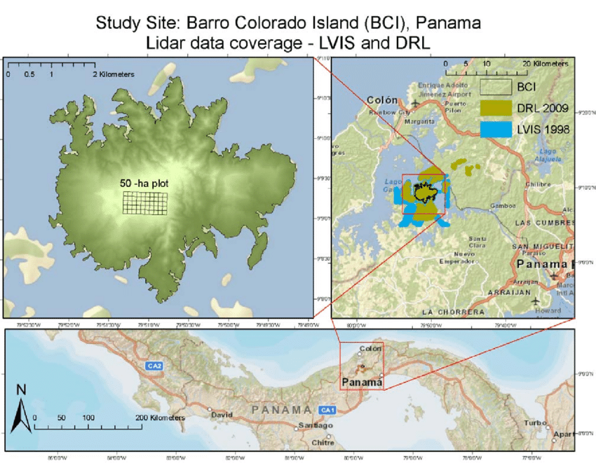

```{r setup, include=FALSE}
BioDataScience2::learnr_setup()
SciViews::R("explore", lang = "fr")

# Chargement du jeu de données
bci <- read("BCI", package = "vegan")
```

```{r, echo=FALSE}
BioDataScience2::learnr_banner()
```

```{r, context="server"}
BioDataScience2::learnr_server(input, output, session)
```

------------------------------------------------------------------------

## Objectifs

Ce tutoriel consacré au positionnement multidimensionnel (MDS) vise à :

-   Vérifier que vous avez bien compris les différentes étapes pour la réalisation d'une MDS : calcul de la matrice de distance, calcul du positionnement des points, réalisation de la carte et vérification de sa validité, choix entre MDS métrique ou non métrique.
-   Vous préparer à analyser et interpréter de manière autonome un jeu de données multivariées à l'aide des MDS.

Vous devez avoir compris le contenu du [module 9](https://wp.sciviews.org/sdd-umons2/?iframe=wp.sciviews.org/sdd-umons2-2023/db-mds.html) du cours et en particulier la [section 9.2](https://wp.sciviews.org/sdd-umons2/?iframe=wp.sciviews.org/sdd-umons2-2023/positionnement-multidimensionnel-mds.html). Assurez-vous d'avoir réalisé les exercices H5P qui s'y trouvent avant de vous lancer dans ce tutoriel Learnr et de maîtriser les notions sur les matrices de distances vue dans le [module 6](https://wp.sciviews.org/sdd-umons2/?iframe=wp.sciviews.org/sdd-umons2-2023/distance-entre-individus.html).

## Barro Colorado Island

Barro Colorado est une île artificielle située sur le lac Gatùn, au centre du Panama. Elle représente un lieu de recherche scientifique intensive axée sur l'écologie des forêts tropicales.



Une surface permanente de 50 hectares a été définie par l'Institut de recherche tropicale Smithsonian et l'Université de Princeton pour étudier la dynamique de la végétation. Cette surface est divisée en 50 parcelles de 1 ha qui s'alignent les unes sur les autres. Dans chaque parcelle, le dénombrement de toutes les espèces forestières a été réalisé (seules les plantes avec un DHP \>= 10 cm [Diamètre mesuré à plus ou moins 1,3m] sont disponibles dans cet ensemble de données). Au total, 225 espèces différentes ont été observées.


Les données peuvent être chargées à partir de `BCI` du package {vegan} et se présentent comme ceci :

```{r, echo=TRUE}
bci <- read("BCI", package = "vegan")
bci
```

Toutes les variables du tableau représentent des espèces (il n'y a pas ici une variable qui spécifie la station, par exemple). Elles sont donc toutes utilisables pour notre analyse.

<!-- TODO: il manque une partie description des données et éventuellement une transformation, cf espèces rares, mais le graphique boxplot parallèle est inutilisable avec 225 espèces!!! -->

### Matrice de distance

Lors de la réalisation d'une MDS, la première étape nécessite de construire une matrice de distances entre les stations ou entre les espèces comme vous l'aviez fait pour la CAH. Pour cela, nous utiliserons la fonction `dissimilarity()` que vous connaissez déjà. Rappelez-vous que vous devrez commencer par sélectionner une métrique adaptée à votre jeu de données pour calculer votre matrice. Pour rappel, vous explorez l'aide en ligne de `?vegan::vegdist` pour déterminer les arguments à utiliser dans `dissimilarity()`.

A partir du jeu de données `bci`, calculez la matrice de distances entre stations en utilisant l'indice de Bray-Curtis sans transformation des données afin de privilégier les espèces les plus abondantes dans votre analyse (choix au départ).

```{r dist_h2, exercise=TRUE}
bci_dist <- ___(___, ___)
```

```{r dist_h2-hint-1}
bci_dist <- ___(___, method = "___")

#### ATTENTION: Hint suivant = solution !####
```

```{r dist_h2-solution}
## Solution ##
bci_dist <- dissimilarity(bci, method = "bray")
```

```{r dist_h2-check}
grade_code("Vous n'avez pas oublié comment on fait pour calculer une matrice de distances avec la fonction `dissimilatity()`. C'est maintenant que cela devient intéressant...")
```

## MDS métrique (ou PCoA)

Lorsque votre matrice de distance `bci_dist` est calculée, vous allez pouvoir visualiser son contenu en réalisant une MDS métrique ou analyse en coordonnées principales (PCoA). L'objectif est de *"projeter"* le nuage de points initial à *p* dimensions (les *p* variables) dans un espace réduit à deux dimensions. Afin de calculer votre MDS métrique vous utilisez la fonction `mds$metric()` et `chart()` permet de visualiser votre ordination en deux dimensions (nommez simplement vos stations de 1 à 50 dans l'ordre d'apparition dans le tableau).

```{r metric_prep}
bci_dist <- dissimilarity(bci, method = "bray")
```

```{r metric_h2, exercise=TRUE, exercise.setup="metric_prep"}
bci_mds <- ___(___)
___(___, labels = 1:50)
```

```{r metric_h2-hint-1}
bci_mds <- ___$___(bci_dist)
___(bci_mds, labels = 1:50)

#### ATTENTION: Hint suivant = solution !####
```

```{r metric_h2-solution}
## Solution ##
bci_mds <- mds$metric(bci_dist)
chart(bci_mds, labels = 1:50)
```

```{r metric_h2-check}
grade_code("Vous venez de réaliser votre première MDS métrique. Sur ce graphique, les stations qui sont proches les unes des autres ont un indice de dissimilarité faible et se ressemblent du point de vue de la composition en végétaux. Notez bien que ni l’orientation des axes, ni les valeurs absolues sur ces axes n’ont de significations particulières. Sur ce graphique, vous pouvez voir qu'un petit groupe d'une douzaine de parcelles se détache à gauche du graphique. Un autre groupe s'individualise dans le bas... mais avant d'interpréter, nous devons vérifier le GOF pour déterminer si la représentation reste suffisamment fidèle à la réalité.") 
```

### Goodness-of-fit

Vérifiez toujours les indicateurs de "Goodness-of-fit" (GOF avec `glance()`) qui vous donneront une idée de la qualité de la projection MDS.

```{r gof_prep}
bci_dist <- dissimilarity(bci, method = "bray")
bci_mds <- mds$metric(bci_dist)
```

```{r gof_h2, exercise=TRUE, exercise.setup="gof_prep"}
___(___)
```

```{r gof_h2-hint-1}
___(bci_mds)

#### ATTENTION: Hint suivant = solution !####
```

```{r gof_h2-solution}
## Solution ##
glance(bci_mds)
```

```{r gof_h2-check}
grade_code("Répondez maintenant à la question qui vous est proposée ci-dessous.") 
```

```{r qu_mds}
question("Considérez vous que cette PCoA est exploitable ?",
  answer("oui, sur base du goodness-of-fit, la PCoA est fidèle aux distances"),
  answer("non, le goodness-of-fit est trop faible, nous devons tenter une MDS non métrique", 
  correct = TRUE),
  allow_retry = TRUE,
  correct = "Ces valeurs sont trop faibles. L'indicateur GOF1 donne une mesure de la part de variance du jeu de données initial qui a pu être représentée. L'indicateur GOF2 quant à lui correspond à la somme des valeurs propres positives uniquement. Dans notre cas, les valeurs de GOF ne sont pas très élevées, nous devons donc considérer que la carte n'est pas très représentative.",
  incorrect = "Corrigez votre réponse. Plus la valeur se rapproche de 1, mieux ce sera. Des valeurs inférieures à 0.7 sont déjà limites.")
```

## MDS non métrique

Tout comme la MDS métrique, la MDS non métrique, obtenue grâce à `mds$nonmetric()`, utilise une matrice de distances pour réaliser une carte mais en autorisant des écarts entre les individus plus flexibles. On pourra donc forcer la carte à être littéralement écrasée, tant que l'ordre des points est gardé intact dans la distorsion (une dissimilarité plus grande ne peut pas être représentée par une distance plus petite sur la carte). Cette distorsion est appelée un stress.

Le calcul réalisé est itératif, et comme il n'est pas garanti de converger, vous vérifierez qu'une solution à bien été trouvée (indication `*** Solution reached` à la fin). Pour les détails et les paramètres de cet algorithme, référez-vous à l'aide en ligne de la fonction `?vegan::metaMDS`.

Vous avez toujours à disposition la matrice de distance `bci_dist` sur laquelle vous allez réaliser votre MDS non métrique. Utilisez ensuite `chart()` pour réaliser la carte permettant de visualiser les distances entre les stations (que vous numérotez de 1 à 50 dans l'ordre d'apparition).

```{r nonmetric_prep}
bci_dist <- dissimilarity(bci, method = "bray")
```

```{r nonmetric_h2, exercise=TRUE, exercise.setup="nonmetric_prep"}
bci_nmds <- ___(___)
___(___, labels = 1:50)
```

```{r nonmetric_h2-hint-1}
bci_nmds <- ___$___(bci_dist)
___(bci_nmds, labels = 1:50)

#### ATTENTION: Hint suivant = solution !####
```

```{r nonmetric_h2-solution}
## Solution ##
bci_nmds <- mds$nonmetric(bci_dist)
chart(bci_nmds, labels = 1:50)
```

```{r nonmetric_h2-check}
grade_code("La représentation que nous obtenons est assez différente de celle de la MDS métrique. On retrouve deux groupes plus ou moins séparés à gauche et au centre du graphique et puis deux stations isolées vers la droite et le haut du graphique.") 
```

### Qualité de l'ajustement

La MDS non métrique est assortie d'indicateurs permettant d'évaluer d'une part la qualité de l'ajustement et d'autre part la fonction de stress appliquée. Comme pour la PCoA, vous pouvez utiliser la fonction `glance()` pour obtenir une mesure de l'ajustement global de la MDS.

Analysez les indicateurs de l'objet `bci_nmds` que vous venez de créer et répondez à la question ci-dessous.

```{r ajust_prep}
bci_dist <- dissimilarity(bci, method = "bray")
bci_nmds <- mds$nonmetric(bci_dist)
```

```{r ajust_h2, exercise=TRUE, exercise.setup="ajust_prep"}
___(___)
```

```{r ajust_h2-hint-1}
___(bci_nmds)

#### ATTENTION: Hint suivant = solution !####
```

```{r ajust_h2-solution}
## Solution ##
glance(bci_nmds)
```

```{r ajust_h2-check}
grade_code("Bon, on commence à s'habituer à l'usage simple de `glance()`. Analysez maintenant ces mesures et répondez à la question ci-dessous.") 
```

```{r qu_nmds}
question("Considérez vous que cette MDS non métrique est de qualité ?",
  answer("Oui, car le R^2 non métrique est plus élevé que le R^2 linéaire."),
  answer("Oui, les R^2 sont excellents, même si la linearité de la transformation est un peu en dessous.", correct = TRUE),
  answer("Non, le R^2 nion métrique est excellent, mais le R^2 linéaire un cran en dessous révèle un problème."),
  answer("Non, il y a trop de différences entre les deux R^2."),
  allow_retry = TRUE,
  correct = "Dans la MDS non métrique, c'est le R^2 non métrique qui importe le plus. Un R^2 linéaire très élevé est un plus, mais n'est pas indispensable. D'ailleurs s'il est également très élevé, une MDS métrique pourrait convenir également et est plus rapide à calculer.",
  incorrect = "Pas tout à fait. Plus la valeur du R^2 se rapproche de 1, mieux c'est, mais les deux R^2 n'ont pas la même importance ici.")
```

### Diagramme de Shepard

Le diagramme de Shepard (fonction `shepard()` pour le calculer puis `chart()` pour l'afficher) visualise la distorsion introduite par notre MDS non métrique. Une différence importante entre le R^2^ linéaire et le R^2^ non linéaire est une première indication d'un stress important. La fonction `shepard()` demande d'une part la matrice de distance de départ et d'autre part, l'objet **nmds** pour pouvoir réaliser le calcul.

Sur le diagramme des dissimilarités de la matrice *versus* distances sur la carte, le trait rouge matérialise la fonction de stress. Plus les points sont proches de ce trait, mieux c'est en mode non linéaire. De plus, si ce trait se rapproche d'une droite, alors la linéarité est d'autant mieux respectée également. C'est donc une analyse en deux étapes que l'on fait ici par observation du diagramme : d'abord, une fidélité pour des distances similaires, et en second lieu, un respect des distances relatives les unes par rapport aux autres.

Réaliser le diagramme de Shepard pour votre MDS non métrique.

```{r shepard_prep}
bci_dist <- dissimilarity(bci, method = "bray")
bci_nmds <- mds$nonmetric(bci_dist)
```

```{r shepard_h2, exercise=TRUE, exercise.setup="shepard_prep"}
bci_sh <- ___(___, ___)
___(___)
```

```{r shepard_h2-hint-1}
bci_sh <- ___(bci_dist, ___)
___(bci_sh)

#### ATTENTION: Hint suivant = solution !####
```

```{r shepard_h2-solution}
## Solution ##
bci_sh <- shepard(bci_dist, bci_nmds)
chart(bci_sh)
```

```{r shepard_h2-check}
grade_code("Comme vous le voyez, les points sont relativement proches de la fonction de stress. Et plus ils seront proches, mieux ce sera. Par contre la forme de la fonction de stress n'est pas très linéaire. Nous pouvions nous y attendre, car si cela avait été le cas, la MDS métrique aurait aussi bien fonctionné sur ces données.") 
```

## Conclusion

Félicitation ! Vous venez de terminer votre auto-évaluation relative au positionnement multidimensionnel. Vous maîtrisez maintenant les notions et fonctions de base nécessaires pour la réalisation de ce type d'analyse et vous pouvez vous lancer dans le projet relatif à cette matière.

```{r comm_noscore, echo=FALSE}
question_text(
  "Laissez-nous vos impressions sur cet outil pédagogique",
  answer("", TRUE, message = "Pas de commentaires... C'est bien aussi."),
  incorrect = "Vos commentaires sont enregistrés.",
  placeholder = "Entrez vos commentaires ici...",
  allow_retry = TRUE
)
```
